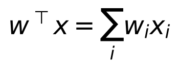
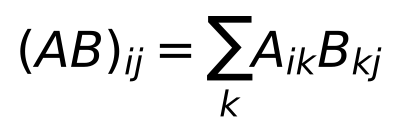
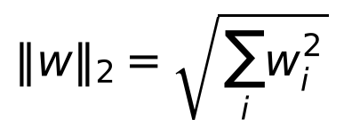
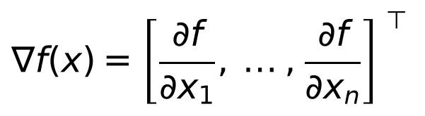
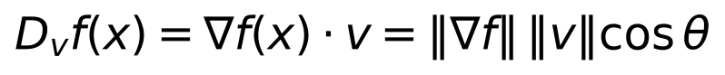
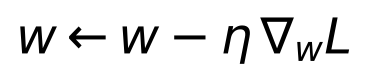
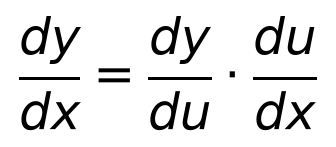
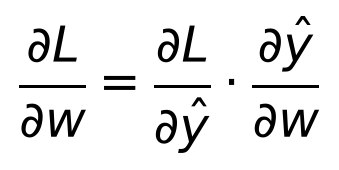
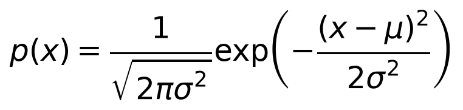
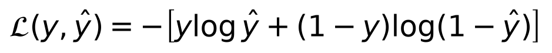

# Day 1 — Mathematical Foundations for Deep Learning

**Goal today:** every formula you'll meet for the next 14 days — a linear
layer, a loss function, a gradient update, backpropagation itself — is
built from five ideas: vectors/matrices, dot products, derivatives, the
chain rule, and a couple of probability facts. Get these solid once and
everything downstream is just these five ideas wearing different clothes.

**Code:** `code/gradcheck.py` — run it: `python code/gradcheck.py`

---

## 1. Vectors, matrices, and why a "layer" is a matrix multiply

A data point (an image's pixels, a sentence's word vector, a row of a
spreadsheet) is represented as a **vector** `x ∈ ℝⁿ`. A neural network
layer's weights are a **matrix** `W`, and its bias is a vector `b`. The
layer's output is:

```
z = Wx + b
```

Under the hood this is just many **dot products** at once — one per output
neuron:



and matrix multiplication is nothing more than a grid of these dot
products computed together:



**Insight:** you never need to think of a layer as "many separate neurons
computing separately." It is one matrix multiply. This is *why* GPUs make
deep learning practical — a GPU is, physically, a chip optimized for doing
huge numbers of multiply-adds in parallel, and `Wx` is exactly that.

### Norms

The **L2 norm** measures a vector's length:



You'll see this everywhere: weight regularization (Day 6) penalizes
`‖w‖²` to discourage huge weights; gradient clipping (Day 14) rescales a
gradient vector when its norm exceeds a threshold; embedding similarity
is often just a dot product divided by norms (cosine similarity).

---

## 2. Derivatives and the gradient vector

A derivative `df/dx` answers: *if I nudge `x` up by a tiny amount, how
much does `f(x)` change, per unit of nudge?* For a function of many
variables (like a loss function of thousands of weights), the natural
generalization is the **gradient** — a vector of all the partial
derivatives:



**Insight — why gradient descent works (a real proof, not folklore):**
the **directional derivative** of `f` in direction `v` (unit length) is



By Cauchy-Schwarz, `cos θ` is maximized (=1) exactly when `v` points the
same direction as `∇f`. So **the gradient is, by construction, the
direction of steepest *ascent*** — and `-∇f` is the direction of steepest
*descent*. This is not a heuristic or a name that sounds right; it's a
direct consequence of the dot-product identity above. Every optimizer in
this course (Day 5) is some refinement of "take a step in the `-∇f`
direction":



`η` (eta) is the **learning rate** — how big a step to take. Too large and
you overshoot the minimum; too small and training crawls. You'll feel
this directly in Day 3's exercises.

---

## 3. The chain rule — the one rule backprop is built on

Single-variable chain rule:



If `y` depends on `x` only *through* an intermediate quantity `u`, the
total sensitivity of `y` to `x` is the product of the two local
sensitivities. A neural network is a long *chain* of composed functions
(linear → activation → linear → activation → ... → loss), so computing
`∂Loss/∂(any weight)` is just chaining this rule through every layer
between that weight and the loss:



**This single equation is 90% of what "backpropagation" means.**
Everything Day 4 adds is bookkeeping: doing this multiplication
efficiently, layer by layer, backward from the loss, reusing intermediate
results instead of recomputing them (that reuse is *why* it's called
back*propagation* and not just "the chain rule").

### Proving it to yourself: gradient checking

`code/gradcheck.py` computes the gradient of a tiny one-neuron function
(`linear → sigmoid → squared error`) two independent ways:

1. **Analytically** — writing out the chain rule by hand, exactly as
   above, and coding the resulting formula directly.
2. **Numerically** — going back to the raw definition of a derivative,
   the *central difference* estimate:
   `f'(x) ≈ (f(x+h) − f(x−h)) / (2h)` for a tiny `h` (here `1e-5`).

Running it:

```
analytic gradient:  [-0.011538  0.012123 -0.058769 -0.009626  0.049157]
numerical gradient: [-0.011538  0.012123 -0.058769 -0.009626  0.049157]
max |analytic - numeric| = 2.41e-12
gradcheck PASSED
```

**Why this matters beyond today:** this is a real, standard debugging
technique. Whenever you implement a new differentiable operation by hand
(a custom loss, a custom layer, a research idea), gradcheck is how you
verify the math and the code agree *before* trusting a training curve.
PyTorch ships this exact tool as `torch.autograd.gradcheck`. Day 2
introduces `autograd`, which computes the analytic side automatically —
but understanding that it's doing the same chain-rule bookkeeping you just
did by hand is the whole point of today.

---

## 4. Two probability facts you'll use immediately

**The Gaussian (normal) distribution:**



You'll meet this again on Day 6 (weight initialization draws from a scaled
Gaussian) and Day 12 (VAEs explicitly model latent variables as Gaussian).

**Binary cross-entropy is *not* an arbitrary loss function** — it falls
out of asking "what set of parameters makes the observed labels *most
probable*, if `ŷ` is the model's predicted probability of class 1 (a
Bernoulli distribution)?" Maximizing that likelihood is equivalent to
minimizing its negative log:



**Insight:** classification losses are (negative log-)likelihoods under
some assumed probability distribution over labels; regression losses
(Day 5) are the same thing under a Gaussian noise assumption. This
reframes "which loss function should I use?" from folklore into a
concrete modeling choice: *what distribution do I believe the labels come
from?*

---

## Library notes: NumPy

Every generator in `../_shared/synthetic_data.py` and today's
`gradcheck.py` is built on NumPy, so it's worth being explicit about the
two ideas that make it (and, by extension, PyTorch tensors) fast:

- **Arrays, not lists.** A NumPy array is a fixed-size, contiguous block
  of memory with one dtype (e.g. `float32`) — unlike a Python list, which
  is a list of pointers to arbitrary objects. This is what makes
  vectorized math fast: `w * x` is a tight C loop over contiguous memory,
  not a Python-level loop with per-element type checks.
- **Broadcasting.** `w_plus = w.copy(); w_plus[i] += h` works elementwise
  without an explicit loop over dimensions when shapes are compatible.
  The rule: dimensions are compared right-to-left; they're compatible if
  they're equal or one of them is 1. This exact rule is what lets you
  write `X + b` in a linear layer even when `X` is `[batch, features]` and
  `b` is `[features]` — `b` is implicitly broadcast across the batch
  dimension. PyTorch tensors use the identical rule (Day 2).
- **`np.random.default_rng(seed)`** (used throughout `synthetic_data.py`)
  is NumPy's modern, recommended random-number API — a `Generator` object
  you pass around explicitly, rather than the older global
  `np.random.seed(...)` state. Explicit generators make experiments
  reproducible without one part of your code accidentally consuming
  randomness meant for another part — worth adopting as a habit now.

---

## Exercises

1. Modify `gradcheck.py` to also check `∂L/∂b` (the bias gradient) both
   analytically and numerically.
2. Change the activation from `sigmoid` to `tanh` (derivative:
   `1 - tanh(z)²`) and re-run gradcheck — confirm it still passes with the
   new analytic formula.
3. By hand (paper), derive `∂L/∂w` for `L = (Wx - y)²` (linear regression,
   no activation) using the chain rule. Compare your answer's *shape*
   against `analytic_grad_w`'s output shape in the code — do they match?

**Next:** Day 2 introduces PyTorch's `autograd`, which computes exactly
the analytic gradient you derived by hand today — automatically, for
arbitrarily deep chains of operations, without you ever writing a
`backward()` formula yourself.
