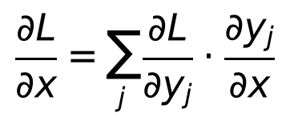
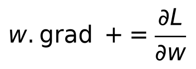

# Day 2 — PyTorch Fundamentals: Tensors and Autograd

**Goal today:** connect yesterday's hand-derived chain rule to the tool
that automates it. By the end, "autograd" should feel like a mechanical
bookkeeping trick you could have invented yourself, not a black box.

**Code:** `code/autograd_vs_manual.py` — run it:
`python code/autograd_vs_manual.py`

---

## 1. Tensors: NumPy arrays that can (a) live on a GPU and (b) remember how they were computed

A `torch.Tensor` is, at the data level, the same idea as a NumPy array
(Day 1): a typed, contiguous, N-dimensional block of numbers with the same
broadcasting rules. Two things are new:

- **Device placement.** A tensor lives on `"cpu"` or `"cuda"` (a GPU). The
  same Python code runs on either; you move data with `.to(device)`.
  Every operation in an expression must be on the same device — mixing a
  CPU tensor and a CUDA tensor raises an error, deliberately, rather than
  silently doing something slow.
- **`requires_grad=True`.** This one flag tells PyTorch: "remember every
  operation applied to this tensor, so I can later ask for gradients
  through it." Tensors created this way, or derived from ones that are,
  become nodes in a **computation graph** that autograd builds *as your
  code runs* — not compiled ahead of time. This is PyTorch's defining
  design choice, called **define-by-run** (or "eager mode"): the graph for
  a given forward pass is whatever Python code actually executed, so
  ordinary Python control flow (an `if`, a `for` loop with a
  data-dependent length) can shape the graph itself. This is why RNNs
  with variable-length sequences, or models with input-dependent branching,
  are natural to write in PyTorch.

## 2. What `.backward()` actually does

Every tensor operation you use (`+`, `*`, `torch.dot`, `torch.sigmoid`,
`**2`, ...) is really two functions bundled together: a **forward**
function (compute the output) and a **backward** function (given the
gradient of the loss with respect to *this operation's output*, produce
the gradient with respect to *this operation's inputs* — exactly one
factor in a chain-rule product from Day 1).

`loss.backward()` walks this graph **in reverse topological order** — from
the loss backward to every leaf tensor with `requires_grad=True` —
multiplying local derivatives together at each step, exactly per the
chain rule you used by hand yesterday:


`code/autograd_vs_manual.py` makes this concrete: it builds the identical
one-neuron function from Day 1's `gradcheck.py`, calls `.backward()`, and
compares the result *element-for-element* against yesterday's hand-derived
`analytic_grad_w()`. They match to floating-point precision (`0.00e+00`
difference) — because they are computing the same thing, one by algebra
on paper, one by automated graph traversal.

### Why gradients are stored on `.grad`, and why they *accumulate*

When a tensor feeds into the loss through **multiple paths** (a weight
shared across timesteps in an RNN, or simply calling `.backward()` twice
on overlapping graphs), the correct total gradient is the *sum* over every
path — this is the multivariable chain rule:



To support this correctly, PyTorch makes `.grad` an **accumulator**, not a
fresh value each time:



**This is the single most common PyTorch training bug.** If you call
`.backward()` on a second batch without first clearing `.grad`, the new
gradient gets *added* to the old one instead of replacing it — the demo
script shows this directly: a second, unrelated `.backward()` call
produces exactly double the correct gradient. This is precisely why every
training loop you'll write from Day 3 onward starts each step with
`optimizer.zero_grad()`.

## 3. `no_grad()` and `.detach()` — telling autograd "don't bother"

Building and remembering a computation graph costs memory and compute.
When you don't need gradients (running a trained model on new data, or
computing a metric you won't backpropagate through), wrap the code in:

```python
with torch.no_grad():
    predictions = model(x)   # no graph built, faster, less memory
```

`.detach()` does the same thing for a single tensor — it returns a copy
that's disconnected from the graph, useful when you want a value (e.g. to
log or plot) without dragging its whole computation history along with it
(as `autograd_vs_manual.py` does with `w.detach().numpy()` before handing
weights to Day 1's plain-NumPy function, which knows nothing about
autograd).

## 4. In-place operations — a sharp edge worth knowing about early

Operations ending in `_` (e.g. `x.add_(1)`, `x.relu_()`) modify a tensor
**in place** instead of returning a new one. This can silently break
autograd: if an in-place op overwrites a value the backward pass still
needs (to compute a local derivative), PyTorch either errors loudly (the
good case) or, in rarer cases, produces a wrong gradient. Until you have a
specific memory-saving reason to reach for in-place ops, prefer the
non-underscore versions (`y = x.add(1)`), especially anywhere near a
`requires_grad=True` tensor.

---

## Library notes: `torch` core

- **Creating tensors:** `torch.tensor(data)` (from a Python list/NumPy
  array), `torch.randn(shape)` / `torch.zeros(shape)` /
  `torch.arange(...)` for generated data, and `torch.from_numpy(arr)` for
  a *zero-copy* view over an existing NumPy array (mutating one mutates
  the other — useful to know, occasionally a source of bugs).
- **dtype matters.** `torch.float32` is the default and what you want for
  almost all training (matches GPU tensor-core throughput); `torch.long`
  (`int64`) is required for classification labels and embedding/index
  lookups; mixing dtypes in one operation raises an error rather than
  silently upcasting everything to the widest type.
- **`.view()` vs `.reshape()` vs `.contiguous()`:** `.view()` reinterprets
  the *same* underlying memory with a new shape and requires that memory
  to already be laid out contiguously (e.g. not the result of a
  `.transpose()`, which only swaps stride metadata without moving data);
  `.reshape()` does the same when possible but silently falls back to
  copying when it isn't. If you ever see `RuntimeError: view size is not
  compatible...`, either switch to `.reshape()` or call `.contiguous()`
  first.
- **`nn.Parameter`** (met properly on Day 4) is just a `Tensor` subclass
  with `requires_grad=True` set by default and automatic registration
  with a module's parameter list — the mechanism `model.parameters()`
  relies on to find every learnable weight in a network.
- **Reproducibility:** `torch.manual_seed(0)` (used at the top of every
  script in this course) seeds PyTorch's own random number generator,
  separately from NumPy's (Day 1) — set both explicitly when you need a
  fully reproducible run, and be aware that exact bitwise reproducibility
  across different GPUs/driver versions is not guaranteed even with a
  fixed seed (only that the seed makes a *given* environment reproducible).

---

## Exercises

1. In `autograd_vs_manual.py`, add `optimizer.zero_grad()`-style reset by
   hand (`w.grad = None`) between the two `.backward()` calls and confirm
   the "accumulation gotcha" section no longer shows doubled gradients.
2. Change `x` and `w` to `requires_grad=False` and `True` respectively,
   call `.backward()`, and check `x.grad` — what happens, and why does it
   make sense given `x` represents fixed input data rather than a
   learnable parameter?
3. Wrap the forward pass in `with torch.no_grad():` and try calling
   `.backward()` on the resulting loss. Read the error message closely —
   it's telling you exactly what "no graph was built" means in practice.

**Next:** Day 3 uses everything so far — matrix multiply, gradients, the
chain rule, autograd — to train your first real model: a single-layer
perceptron learning to separate two classes, watched update by update.
