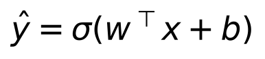
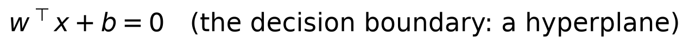
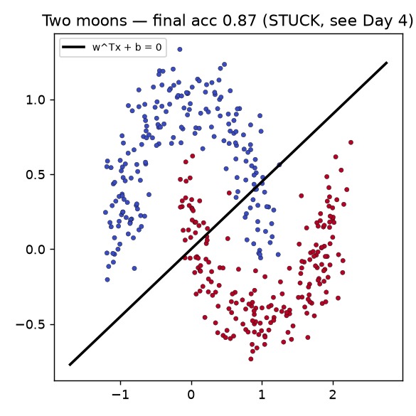
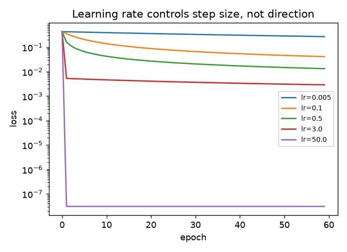
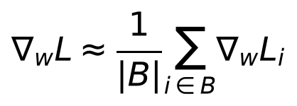

# Day 3 — The Perceptron and Gradient Descent in Practice

**Goal today:** train your first real model end to end, watch it actually
learn, and — just as importantly — watch it **fail** in an instructive way.
Everything here uses only what Days 1-2 built: a dot product, a gradient,
the chain rule, and autograd.

**Code:** `code/train_perceptron.py` — run it:
`python code/train_perceptron.py`

---

## 1. The model: one linear layer plus a squashing function

A single-layer perceptron for binary classification is:



`σ` is the sigmoid function, squashing any real number into `(0, 1)`, read
as "probability of class 1." Geometrically, `w` and `b` define a
**hyperplane** (a line, in 2D) that splits the input space in two:



Every point is classified by which side of that line it falls on. This is
the model's entire representational capacity — no matter how you tune `w`
and `b`, the boundary is *always a straight line*. Keep that in mind for
§3.

## 2. The training loop — a pattern you'll type for the rest of this course

```python
for epoch in range(epochs):
    logits = model(X)                 # forward pass
    loss = loss_fn(logits, y)         # how wrong are we
    optimizer.zero_grad()             # clear old .grad  (Day 2)
    loss.backward()                   # chain rule, automatic (Day 1-2)
    optimizer.step()                  # w <- w - lr * grad  (Day 1)
```

This five-line skeleton does not change for the rest of the course. A
transformer's training loop (Day 10) looks identical at this level of
zoom — only `model`, `loss_fn`, and the data change. Internalizing that
this loop is *always the same* is one of the most useful mental
simplifications in deep learning: complexity lives in the model
architecture and the data, not in "how training works."

`nn.Linear(2, 1)` is PyTorch's built-in `Wx + b` — Day 1's matrix multiply,
wrapped as a reusable module with `.weight` and `.bias` as
`nn.Parameter`s (auto-registered for `.parameters()`, met in Day 2).
`nn.BCEWithLogitsLoss` fuses sigmoid + binary cross-entropy (Day 1's
`eq_bce`) into one numerically-stable operation — always prefer the fused
version over manually chaining `sigmoid()` then `BCELoss()`, since
computing `log(sigmoid(z))` directly (rather than `log` of an already
-rounded probability) avoids underflow when `z` is very negative.

## 3. Case 1 vs Case 2: the same model, two different outcomes

**Linearly separable data** (`make_linearly_separable`, two well-apart
Gaussian blobs): the perceptron reaches **100% accuracy within ~20
epochs.** A straight line genuinely exists that separates the classes, so
gradient descent finds one.

**Two moons** (`make_moons`, two interleaving crescents): accuracy
plateaus around **86-87%** and *stays there* — more training does not
help.



**This is not a bug or an undertrained model — it's a hard mathematical
ceiling.** No straight line can separate two interleaving crescents; the
best any linear boundary can do is cut through the region where they
overlap and accept the resulting errors on both sides. Look at the plotted
boundary: it's doing the *best possible* job a straight line can do, and
that job is capped well below 100%. **This is exactly the gap Day 4
closes** — a second layer bends the decision boundary into a curve by
composing two linear transforms with a nonlinearity between them.

## 4. Learning rate: the knob you'll tune more than any other

`code/train_perceptron.py`'s third experiment trains the *same* separable
problem at five learning rates and plots the loss curve for each:



Two things worth noticing, both faithful to what the plot actually shows
(not a generic textbook claim):

- **Within this range, higher `lr` converges faster** — `lr=50` reaches a
  loss near `1e-7` in a single epoch, while `lr=0.005` is still above
  `0.2` after 60 epochs. Gradient descent's update rule (Day 1) scales the
  step by `lr`, so a bigger `lr` genuinely means bigger, faster progress
  *when the direction is trustworthy*.
- **It doesn't diverge even at `lr=50`, and that's worth explaining, not
  just noting.** This is a well-conditioned, convex problem (logistic
  regression has a single global minimum, no local minima to get trapped
  in), and `BCEWithLogitsLoss`'s gradient is naturally self-limiting: as
  predictions approach 0 or 1, the sigmoid saturates and the gradient
  magnitude shrinks toward zero, so even a huge `lr` multiplies a tiny
  number. **Do not generalize this to "learning rate doesn't matter" —**
  Day 4's multi-layer, non-convex problems do not have this safety net,
  and you will see real divergence there at high learning rates. What you
  should take from today is narrower and more precise: `lr` controls step
  *size*, the gradient controls step *direction* (Day 1's steepest-descent
  proof), and how forgiving a given problem is of a large step size
  depends on the loss surface's shape, not on the optimizer alone.

## 5. Mini-batch gradients (a preview — Day 5 goes deeper)

`train_perceptron.py` computes the gradient over the *entire* dataset
every step (full-batch gradient descent) — feasible here because the
dataset is tiny. Real datasets are far too large for that, so training
instead estimates the gradient from a random **mini-batch** `B`:



This is an unbiased but *noisy* estimate of the true full-dataset
gradient — noisy in a way that turns out to help generalization (Day 6)
by preventing the optimizer from settling too precisely into sharp,
narrow minima that fit training data idiosyncrasies. "Stochastic Gradient
Descent" (SGD) is exactly this: gradient descent using mini-batch
estimates instead of the full dataset.

---

## Library notes: `torch.nn` and `torch.optim` (first contact)

- **`nn.Linear(in_features, out_features)`** stores `.weight` with shape
  `[out_features, in_features]` and `.bias` with shape `[out_features]`,
  and computes `x @ weight.T + bias`. Default initialization draws from a
  uniform distribution scaled by `1/sqrt(in_features)` — a specific,
  deliberate choice (more on *why* particular scales matter in Day 6).
- **`nn.BCEWithLogitsLoss`** expects raw, unsquashed **logits** (the output
  of `nn.Linear`, before any sigmoid) — not probabilities. This is a
  common first-week bug: applying `sigmoid()` yourself and then also
  calling `BCEWithLogitsLoss` double-squashes the output and silently
  wrecks training. If you want a plain `BCELoss`, apply `sigmoid()`
  yourself and switch loss functions — but prefer the fused version.
- **`torch.optim.SGD(model.parameters(), lr=...)`** is the plain gradient
  descent update rule from Day 1, nothing more, applied to every
  parameter `model.parameters()` reports. Day 5 introduces `momentum` and
  `Adam`, both of which change *how* the step is computed from the
  gradient, without changing anything about how you call `.step()`.
- **`model.parameters()`** is an iterator over every `nn.Parameter` the
  module (and any sub-modules it contains) has registered — this is how
  the optimizer knows what to update without you passing weights by hand.

---

## Exercises

1. Push the learning rate even higher (`lr=500`, `lr=5000`) — does it ever
   diverge on this convex problem? At what point do you start seeing
   `nan` in the loss, and can you connect that to floating-point overflow
   in `exp()` inside the sigmoid?
2. Change `make_linearly_separable`'s blob centers (in
   `../_shared/synthetic_data.py`) to be closer together and rerun — does
   final accuracy still reach 100%? What does the decision boundary plot
   look like when the classes barely overlap?
3. On the moons data, try training for 2000 epochs instead of 100. Does
   accuracy ever exceed ~87%? This is the experiment that should convince
   you the ceiling is architectural, not a matter of "not enough training."

**Next:** Day 4 adds a hidden layer and derives backpropagation through
it by hand — enough to finally solve the two-moons problem this perceptron
couldn't.
