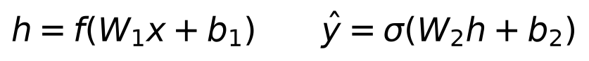
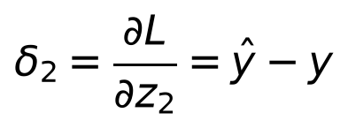
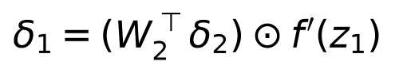
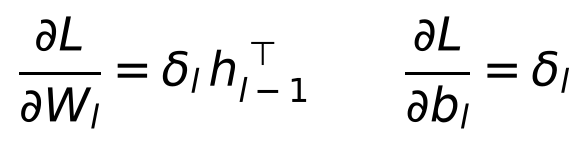
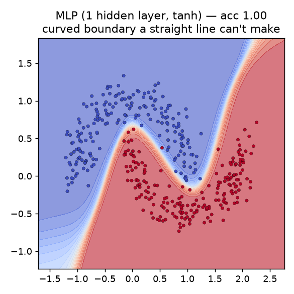
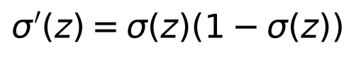
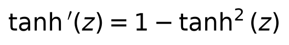
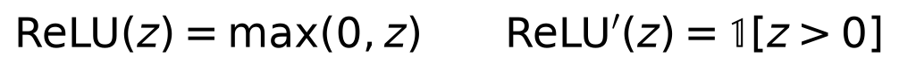
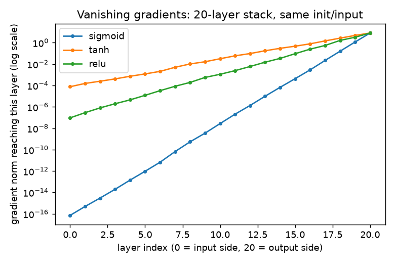

# Day 4 — Multi-Layer Perceptrons and Backpropagation, Derived by Hand

**Goal today:** derive backpropagation through a real hidden layer on
paper, implement it with raw NumPy (no autograd), verify it against
PyTorch, and then actually solve the two-moons problem Day 3's perceptron
couldn't. Second half: understand *why* deep networks with the wrong
activation function are hard to train.

**Code:** `code/mlp_from_scratch.py` (hand-derived backprop + verification
+ training), `code/activations_and_vanishing_gradients.py` (nn.Module
version + vanishing-gradient experiment).

---

## 1. The model: two linear layers with a nonlinearity between them



**Why stacking two *linear* layers alone would be pointless:** if `f` were
the identity, `ŷ = σ(W2(W1 x + b1) + b2) = σ((W2W1)x + (W2b1+b2))` — a
composition of two linear maps is *itself* a linear map. Without a
nonlinearity between them, any number of stacked linear layers collapses
algebraically into one linear layer, with all of Day 3's limitations
intact. **The nonlinearity `f` is what gives depth its power** — it's the
only thing standing between "many layers" and "one layer in disguise."
This is also the informal intuition behind the *universal approximation
theorem*: a single hidden layer, wide enough, with a nonlinearity, can
approximate any continuous function on a bounded domain arbitrarily
closely — width alone, without a nonlinearity, cannot.

## 2. Deriving backprop through two layers

Define the **error signal** `δ` at each layer — how much the loss changes
per unit change in that layer's pre-activation `z`. At the output:



(this specific form — `(ŷ − y)` — is what you get when sigmoid output and
squared-error loss are combined; Day 5 shows the same simplification
happens for softmax + cross-entropy, which is *why* that pairing is so
common in classification).

To get the hidden layer's error signal, you need `∂L/∂h` (how the loss
depends on the hidden activations), which requires summing over **every
path** `h` influences the loss through — exactly Day 2's multivariable
chain rule. Since `h` only reaches the loss via `z2 = W2 h + b2`:



**Read this equation as the entire backpropagation algorithm compressed
into one line:** take the next layer's error signal `δ2`, project it
*backward* through that layer's weights (`W2ᵀ`, the transpose — the same
matrix used forward, now used to route error backward), then multiply
elementwise by the local activation derivative `f'(z1)`. Stack more
layers and you apply this recursion once per layer, always moving from
the output toward the input — hence *back*-propagation. Once you have
each layer's `δ`, the weight gradients are simple outer products:



`code/mlp_from_scratch.py` codes exactly these four equations directly —
no autograd — then checks the result against `torch.autograd` on the
*same* weights and input:

```
dW1: max |manual - autograd| = 9.76e-19
dW2: max |manual - autograd| = 1.39e-17
MATCH (worst case 1.39e-17): the by-hand derivation is exactly backprop.
```

This is the moment the phrase "autograd automates backpropagation" stops
being an assertion and becomes something you've verified with your own
derivation, twice now (Day 2 for one neuron, today for a full hidden
layer).

## 3. Solving what the perceptron couldn't

Training the hand-written MLP on `make_moons` (identical data Day 3
plateaued on at ~87%):

```
epoch   0  avg loss 0.0553  acc 0.855
epoch  90  avg loss 0.0026  acc 0.995
epoch 299  avg loss 0.0013  acc 0.998
final accuracy: 0.998 (perceptron, Day 3, was stuck at ~0.87)
```

The `nn.Module` version in `activations_and_vanishing_gradients.py`
reaches the same result and lets you see *why*, visually — the decision
boundary is no longer a straight line:



That S-curve is literally the hidden layer's `tanh` nonlinearity, warped
and combined by the output layer into a boundary that matches the
crescents' shape. This is the universal approximation theorem stopping
being an abstract claim and becoming a picture.

## 4. Activation functions and their derivatives

Every activation you'll choose between has a specific derivative that
directly enters the backprop recursion above:





Notice sigmoid's derivative is **bounded above by 0.25** (maximized at
`z=0`, where `σ(z)=0.5`) and shrinks toward zero as `|z|` grows — the
function "saturates" for large-magnitude inputs. `tanh`'s derivative is
similarly bounded (by 1, better than sigmoid's 0.25, but still shrinks
at the extremes). **ReLU's derivative is exactly 1 for any positive input
and exactly 0 for any negative input — never a *shrinking* fraction.**

### The vanishing-gradient experiment: what actually happens, honestly

`activations_and_vanishing_gradients.py` stacks 20 identical layers with
one activation function, backpropagates a single loss from the output
back to the input, and records the gradient norm arriving at every layer
along the way — same random weight initialization and same input for all
three activations, so the *only* variable is the activation function:



```
sigmoid : grad norm at output 8.0000, at layer closest to input 7.13e-17
tanh    : grad norm at output 8.0000, at layer closest to input 7.61e-05
relu    : grad norm at output 8.0000, at layer closest to input 9.31e-08
```

**Read this carefully — it's more nuanced than the usual one-line
textbook claim ("sigmoid bad, ReLU fixes it"):**

- **Sigmoid is catastrophic**: the gradient shrinks by roughly **17 orders
  of magnitude** over 20 layers. With a derivative capped at 0.25,
  multiplying 20 such factors together (the repeated application of the
  backprop recursion) is close to `0.25²⁰ ≈ 9×10⁻¹³` in the best case, and
  real saturated units make it far worse — this is why deep sigmoid
  networks were, for years, considered essentially untrainable past a
  handful of layers.
- **ReLU is a large improvement over sigmoid but is not immune here** —
  its gradient still shrank by about 8 orders of magnitude, comparable to
  (in this run, even slightly worse than) `tanh`. **This is the honest,
  important nuance**: ReLU's derivative is exactly 1 or 0, so it doesn't
  *itself* shrink the gradient the way sigmoid does — but the backprop
  recursion also multiplies by the layer *weights* (`W2ᵀ` in the equation
  above) at every step. With PyTorch's default `nn.Linear` initialization
  and no correction for depth, repeatedly multiplying by 20 independently-
  scaled weight matrices still shrinks (or, with different luck, explodes)
  the gradient's overall magnitude — regardless of which activation sits
  between them.
- **The conclusion to actually take from this:** the activation function
  and the weight initialization scheme are **two separate, complementary
  fixes to the same problem**, not one fix that supersedes the other.
  Choosing ReLU removes activation *saturation* as a cause of vanishing
  gradients; it does nothing about the *weight-matrix scale* cause. Day 6
  covers weight initialization schemes (Xavier/Glorot, He/Kaiming)
  designed specifically to keep activation and gradient variance
  approximately constant across depth — solving the piece ReLU alone
  doesn't. Only combining both (ReLU-family activation + depth-aware
  initialization) is what actually makes very deep networks trainable in
  practice, which is exactly what production architectures (ResNet, Day
  8) do.

---

## Library notes: `nn.Module`

- **Subclassing pattern** (`class TwoLayerMLP(nn.Module)`): call
  `super().__init__()` first, then assign every learnable sub-layer as an
  attribute in `__init__` (`self.fc1 = nn.Linear(...)`). PyTorch's
  `nn.Module.__setattr__` is overridden to detect `nn.Parameter` and
  `nn.Module` attributes and register them automatically — this is *how*
  `model.parameters()` (used by the optimizer, Day 3) finds every weight
  in a nested structure without you manually collecting them.
- **`forward(self, x)`** defines what happens when you call `model(x)` —
  `nn.Module.__call__` invokes `forward()` for you, plus some bookkeeping
  (hooks, training/eval mode) you'll meet properly in Day 6. Never call
  `model.forward(x)` directly; always call `model(x)`.
- **Activation modules** (`nn.Sigmoid()`, `nn.Tanh()`, `nn.ReLU()`) are
  stateless — they hold no learnable parameters, only a `forward()` that
  applies the function elementwise. Because they're stateless, the
  *functional* form (`torch.sigmoid(x)`, `F.relu(x)` from
  `torch.nn.functional`) is equivalent and commonly used inside a custom
  `forward()` instead of pre-declaring a module attribute — both are
  idiomatic; this course uses whichever reads more clearly per context.
- **`retain_grad()`** (used in the vanishing-gradient script): by default,
  PyTorch only keeps `.grad` on *leaf* tensors (ones you created directly
  with `requires_grad=True`, like `nn.Parameter`s) to save memory —
  intermediate activations' gradients are computed transiently during
  `.backward()` and then discarded. Calling `.retain_grad()` on an
  intermediate tensor before the backward pass explicitly asks PyTorch to
  keep it around afterward, which is exactly how the demo script inspects
  the gradient reaching every hidden layer instead of only the leaf
  weights.

---

## Exercises

1. Extend `mlp_from_scratch.py`'s `backward()` to a **3-layer** network
   and re-verify against autograd. Notice how the recursion
   (`eq_backprop_recursion`) is literally the same formula applied one
   more time, propagating `δ` one layer further back.
2. Rerun the vanishing-gradient experiment with `depth=5` instead of 20 —
   how much smaller is the effect? At what depth does sigmoid's gradient
   first drop below `1e-8`?
3. In `activations_and_vanishing_gradients.py`, replace `nn.Tanh()` with
   `nn.ReLU()` in `TwoLayerMLP` and retrain on moons. Does it still reach
   ~100% accuracy? (With only 1 hidden layer, depth-related vanishing
   gradients aren't yet a factor — this exercise is testing whether you
   can predict that correctly *before* running it.)

**Next:** Day 5 looks at loss functions and optimizers properly — why
cross-entropy is the right choice for classification, what momentum and
Adam actually do differently from plain SGD, and how learning-rate
schedules fit in.
