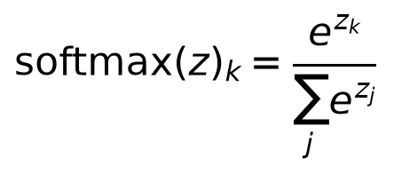
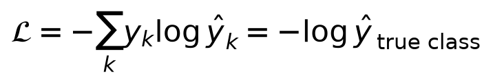
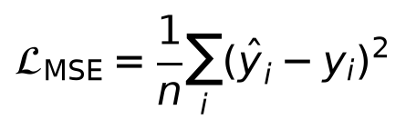
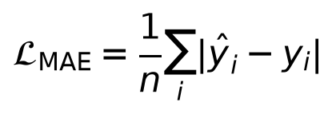
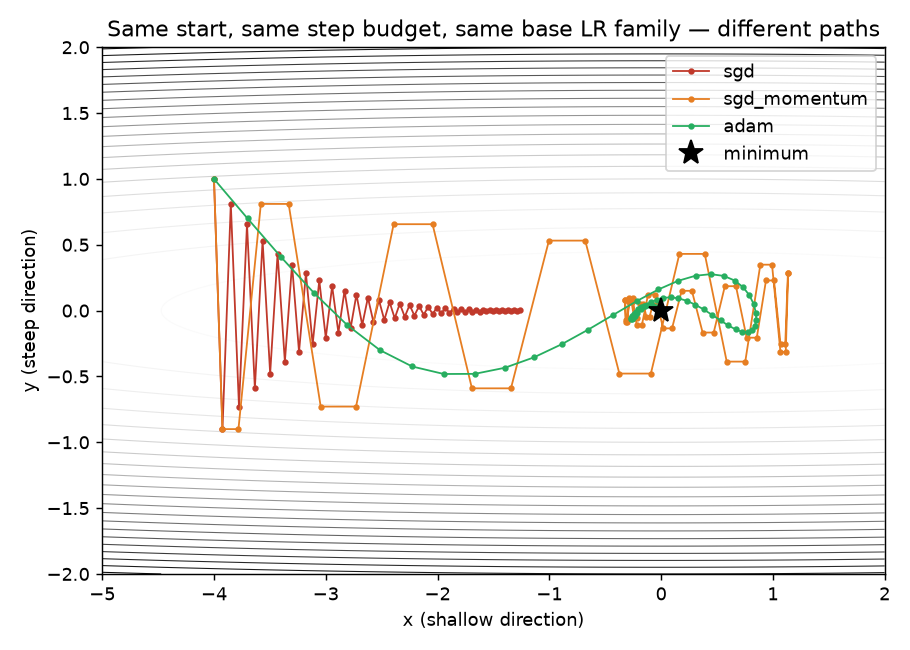
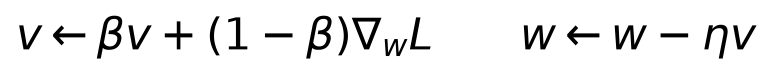
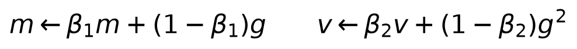
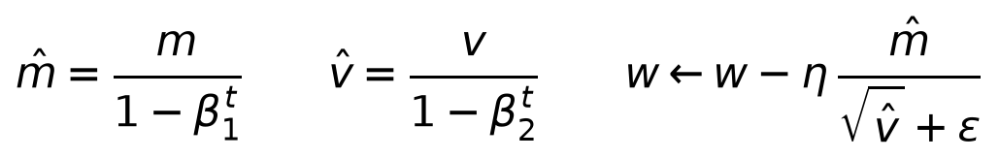

# Day 5 — Loss Functions and Optimizers

**Goal today:** pick losses like a modeling decision, not folklore
(continuing Day 1's likelihood framing), and understand *what problem*
momentum and Adam actually solve — not just how to call them.

**Code:** `code/optimizer_race.py` — run it:
`python code/optimizer_race.py`

---

## 1. Cross-entropy for multi-class classification

Day 1 derived binary cross-entropy as negative log-likelihood under a
Bernoulli distribution. Multi-class classification generalizes this to a
**Categorical** distribution over `K` classes. First, raw network outputs
(logits) are converted to a probability distribution with **softmax**:



Then cross-entropy is, again, just negative log-likelihood — the log
probability the model assigned to the *true* class:



**Insight:** minimizing this loss pushes `ŷ_true` toward 1, which (since
softmax outputs sum to 1) automatically pushes every other class's
probability down — you never need to explicitly penalize the wrong
classes; softmax's normalization does it for you. This is also why
`nn.CrossEntropyLoss` in PyTorch takes raw logits and integer class labels
directly (not one-hot vectors, not pre-softmaxed probabilities) — it fuses
softmax and negative-log-likelihood into one numerically stable operation,
for exactly the same overflow-avoidance reason `BCEWithLogitsLoss` fused
sigmoid+BCE in Day 3.

## 2. MSE vs. MAE for regression — a modeling choice, not a default




MSE (squared error) corresponds to assuming **Gaussian-distributed noise**
around the true value (Day 1's Gaussian pdf, maximized in log-likelihood
by minimizing squared error) — it penalizes large errors *quadratically*,
so a single big outlier can dominate the loss and pull the fit toward it.
MAE (absolute error) is more robust to outliers (linear penalty, not
quadratic) but its gradient has constant magnitude everywhere except at
zero (where it's undefined), which can make fine convergence near the
optimum noisier. **The choice is a statement about your data**: do you
believe errors are roughly Gaussian, or do you expect occasional large
outliers you don't want to dominate training?

## 3. Why plain SGD struggles: an ill-conditioned loss surface

Set up a loss that's steep in one direction and shallow in another —
`L(x,y) = 0.05x² + 5y²` — and race three optimizers from the same start
point, same step budget:



```
sgd            final (x,y)=(-1.2653, 0.0018)  loss=0.080068
sgd_momentum   final (x,y)=(-0.0497, 0.0424)  loss=0.009109
adam           final (x,y)=(-0.0158, 0.0135)  loss=0.000925
```

**Plain SGD (red) is stuck** — it oscillates tightly back and forth across
the steep `y` direction (any learning rate large enough to make real
progress along the shallow `x` direction is *too large* for the steep `y`
direction, causing overshoot every step) and, after 60 steps, has barely
moved past `x=-1.27`. This is not a bug in the demo; it's the defining
weakness of plain gradient descent on any loss surface where curvature
differs sharply by direction — extremely common in real networks, where
different weights have very different effective sensitivities.

### Momentum: an exponential moving average of the gradient



Instead of stepping directly by the current gradient, momentum keeps a
running **velocity** `v` — an exponentially-weighted average of recent
gradients — and steps by that instead. The physical intuition (where the
name comes from): a ball rolling downhill accumulates speed in a
*consistent* direction and is damped in an *oscillating* direction, since
opposite-signed gradients partially cancel in the running average. In the
plot, orange (momentum) makes bigger, overshooting swings — genuinely
riskier per-step — but that same accumulated velocity is what carries it
past the region where plain SGD stalls.

### Adam: momentum *and* a per-parameter adaptive step size




Adam tracks two running averages: `m` (the gradient itself — this is
exactly momentum's `v` from above) and `v` (the *squared* gradient — an
estimate of how large that parameter's gradient tends to be, direction
ignored). Dividing the step by `√v̂` means: **parameters with
consistently large gradients get a smaller effective step, and parameters
with consistently small gradients get a proportionally larger one** — an
automatic, per-parameter learning-rate adjustment. The `1 - β^t`
correction terms fix a real bias: early in training, `m` and `v` are
initialized at zero and are biased toward zero for the first few steps
without this correction (worth remembering if you ever wonder why Adam's
first few update magnitudes look unusually small without it). In the
plot, green (Adam) takes the smoothest, most direct path of the three —
the adaptive step size is effectively solving the ill-conditioning
directly, rather than relying on accumulated velocity to power through it.

**Practical takeaway, not folklore:** Adam is usually the safe default for
getting a new architecture training quickly, precisely because it's far
less sensitive to per-parameter curvature differences than plain SGD.
Well-tuned SGD+momentum can generalize slightly better in some well-
studied settings (notably image classification with a good learning-rate
schedule) — a genuine, still-debated tradeoff in the field, not a settled
"always use X" rule. This course defaults to Adam from here on for
that reason: getting new material training reliably matters more here
than squeezing out the last fraction of generalization performance.

---

## Library notes: `torch.optim`

- **`torch.optim.SGD(params, lr, momentum=0.0)`** — set `momentum=0.9`
  (a very common default) to get the momentum update above; `momentum=0`
  is plain gradient descent (Day 1's update rule exactly).
- **`torch.optim.Adam(params, lr, betas=(0.9, 0.999), eps=1e-8)`** —
  `betas` are `(β1, β2)` from the equations above; `eps` prevents
  division by zero when `√v̂` is tiny. The defaults are good starting
  points for most problems; `lr` is still the one hyperparameter worth
  tuning first.
- **`optimizer.zero_grad()` / `.backward()` / `.step()`** — the same
  three-call pattern regardless of which optimizer class you use (Day 3);
  the optimizer object only changes *how* `.step()` turns `.grad` into a
  parameter update, never the surrounding loop shape.
- **A preview for Day 14**: `torch.optim.lr_scheduler` wraps an optimizer
  to change `lr` over training (e.g. `CosineAnnealingLR`, linear warmup) —
  worth knowing this exists now, covered properly once you have a real
  multi-epoch training run (CNNs, Day 7-8) to apply it to.

---

## Exercises

1. In `optimizer_race.py`, lower plain SGD's learning rate until it stops
   oscillating in `y` — how much smaller does `x`'s progress become as a
   result? This is the tradeoff ill-conditioning forces on plain SGD in
   one number.
2. Add `torch.optim.RMSprop` (momentum's sibling: adapts step size like
   Adam's `v`, but without the `m` momentum term) to the race — where
   does its path fall relative to SGD, momentum, and Adam?
3. Swap `nn.CrossEntropyLoss` in for `nn.BCEWithLogitsLoss` on a modified
   version of Day 4's moons classifier (2 output logits instead of 1,
   `nn.CrossEntropyLoss` expects integer class labels 0/1) — confirm it
   trains to a comparable accuracy.

**Next:** Day 6 asks why models that fit training data perfectly can still
generalize badly — regularization, dropout, batch normalization, and
*why* weight initialization scale matters (the missing half of Day 4's
vanishing-gradient story).
