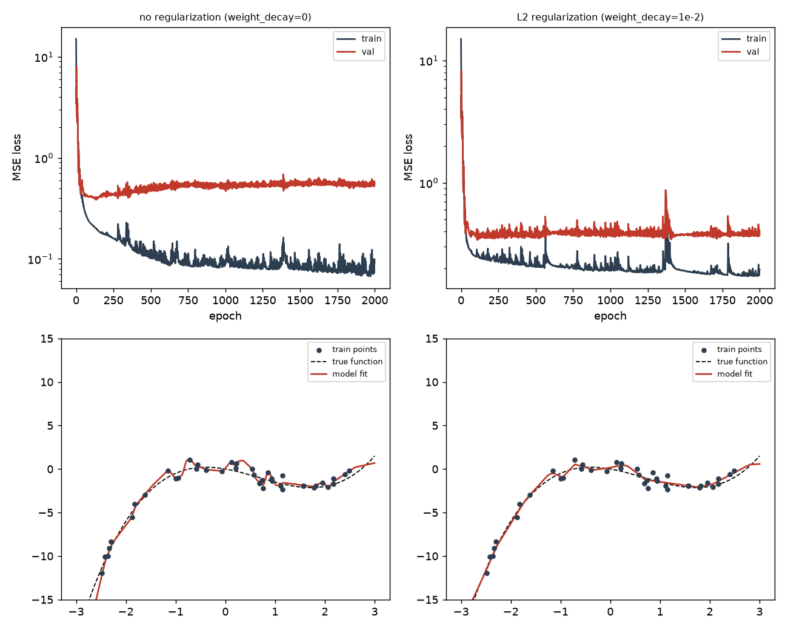
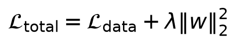
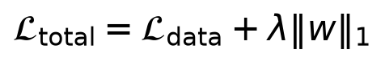
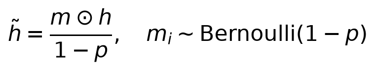
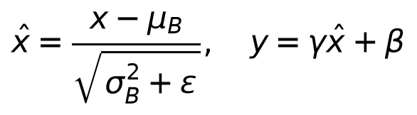
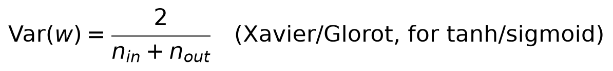
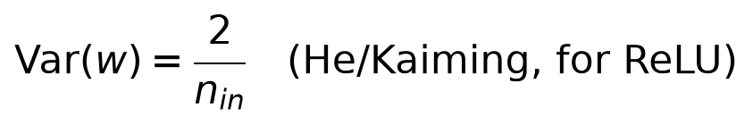
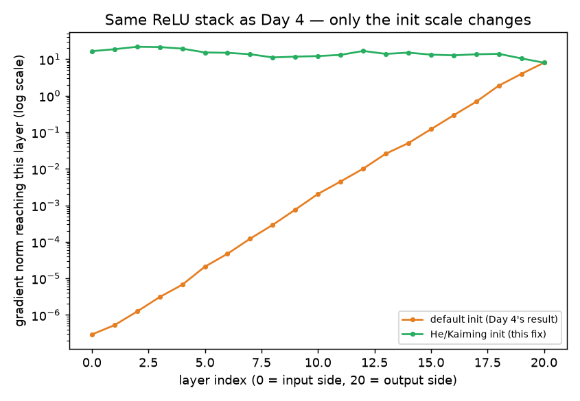

# Day 6 — Regularization, Generalization, and Closing the Vanishing-Gradient Loop

**Goal today:** understand *why* a model that fits training data well can
still be bad — and finish the story Day 4 deliberately left open: does
proper weight initialization succeed where activation choice alone
didn't?

**Code:** `code/overfitting_demo.py`, `code/init_scale_demo.py`

---

## 1. Overfitting, made visible

`code/overfitting_demo.py` trains a deliberately oversized model (3
hidden layers of 128 units — enormous relative to the data) on only 40
noisy points from a cubic function, with and without **L2 regularization**
(`weight_decay` in the optimizer):



```
no regularization  : train_loss=0.0918  val_loss=0.5450  gap=0.4532
L2 regularization  : train_loss=0.1939  val_loss=0.3701  gap=0.1763
```

**The number that matters here is the *gap* between train and val loss,
not either number alone.** Without regularization the model fits the
training points more tightly (lower train loss) but that extra fit
doesn't transfer — the val loss stays roughly flat while train loss keeps
dropping, and the gap between them is the model's error attributable to
memorizing training-specific noise rather than learning the true
underlying pattern. With `weight_decay=1e-2`, train loss is *higher*
(the model is deliberately prevented from fitting as tightly) but val
loss is *lower* — a direct, honest trade of some fit quality for better
generalization, and the gap shrinks by roughly 60%. This tradeoff — never
free, always fit-vs-generalization — is what every regularization
technique in this section is doing in one form or another.

### L2 regularization (weight decay)



Adding `λ‖w‖²` to the loss means the optimizer is no longer just
minimizing prediction error — it's also penalized for having large
weights, so it will only let a weight grow large if doing so earns a
real, larger reduction in prediction error. **Probabilistic view (tying
back to Day 1):** this is exactly equivalent to placing a zero-mean
Gaussian **prior** on every weight and finding the *maximum a posteriori*
(MAP) estimate instead of the maximum likelihood one — `λ` controls how
strong that prior belief ("weights should be small unless the data
strongly argues otherwise") is relative to the data.

### L1 regularization — a different kind of pressure



L1's penalty grows *linearly*, not quadratically, in each weight, and
critically has a constant-magnitude gradient regardless of how small the
weight already is (unlike L2, whose gradient `2λw` shrinks toward zero as
`w→0`, so L2 rarely pushes a weight *exactly* to zero). L1 keeps pushing
until the weight actually reaches zero — producing **sparse** weight
vectors (many exactly-zero weights) rather than L2's "many small but
nonzero weights." This is useful when you want implicit feature
selection, not just smaller weights.

### Dropout — training an implicit ensemble



At every training step, dropout randomly zeroes each unit with
probability `p` (independently, per unit, per forward pass), and rescales
the survivors by `1/(1-p)` so the expected sum stays the same (this is
"inverted dropout," the standard modern form — it keeps inference-time
code simple, since no rescaling is needed at test time; the model is
simply run at full width with `p=0`). **Insight:** because a different
random subset of units is active on every forward pass, the network can't
rely on any single unit or fragile co-adapted combination of units — it's
forced to learn representations that are useful even when parts of the
network vanish. This has a well-known ensemble interpretation: training
with dropout approximates training an exponential number of smaller,
weight-sharing networks and averaging their predictions at test time.

### BatchNorm — a different lever entirely: stabilizing the *distribution* of activations



For each mini-batch, BatchNorm normalizes every unit's activations to
zero mean, unit variance (using that batch's own statistics `μ_B`, `σ_B²`),
then applies a learnable per-channel **scale `γ`** and **shift `β`** — so
the network can still represent any distribution it needs, but starts
from a *controlled*, stable one every layer, every step, rather than
whatever distribution happened to emerge from the previous layer's
weights. It was originally motivated as reducing "internal covariate
shift" (each layer's input distribution changing as earlier layers'
weights update during training); more recent analysis argues its main
benefit is actually smoothing the loss landscape (making gradients more
predictable step-to-step, which lets you safely use a larger learning
rate) — worth knowing both explanations exist, since it's a genuinely
still-debated mechanism, not settled science. Either way, empirically:
BatchNorm reliably makes deep networks train faster and more robustly to
learning-rate choice, and is a near-default component in CNN architectures
(Day 7-8).

## 2. Closing Day 4's loop: does initialization fix what ReLU alone didn't?

Day 4 ended on a specific, honest open question: ReLU's derivative isn't
itself the problem, but a 20-layer stack still lost ~8 orders of gradient
magnitude with PyTorch's *default* initialization. The two schemes below
are derived to keep activation/gradient **variance** approximately
constant across layers, by scaling each layer's initial weight variance
relative to how many inputs/outputs it has:




Xavier/Glorot balances variance for symmetric activations (tanh, sigmoid,
where the expected output is centered near zero); He/Kaiming accounts for
ReLU specifically zeroing out roughly half its inputs (whatever is
negative), so it needs a *larger* variance (`2/n_in` instead of
`2/(n_in+n_out)`) to compensate and keep the surviving half's variance
where Xavier would leave it.

`code/init_scale_demo.py` reruns **the exact same 20-layer ReLU
experiment from Day 4**, changing only the initialization:



```
default init (Day 4's result)  : grad norm at layer closest to input 2.91e-07
He/Kaiming init (this fix)     : grad norm at layer closest to input 1.66e+01
```

**This is the answer to Day 4's open question, not a restatement of it.**
With He initialization, the gradient norm stays within roughly one order
of magnitude across all 20 layers — compare that to default
initialization's steady, near-linear decay (on the log scale) across the
same 20 layers, ending nearly eight orders of magnitude smaller. Nothing
about the activation function changed between these two runs; the *only*
variable was the weight variance at initialization. This confirms Day 4's
prediction directly: ReLU and correct initialization are two independent,
complementary fixes, and you need both for very deep networks to train
reliably — which is exactly why every modern deep architecture (ResNet
and onward, Day 8) pairs a ReLU-family activation with a depth-aware
initialization scheme, never one alone.

---

## Library notes: `nn.init`, `nn.Dropout`, `nn.BatchNorm1d/2d`

- **`nn.init.kaiming_normal_(tensor, nonlinearity="relu")`** and
  **`nn.init.xavier_normal_(tensor)`** implement the two schemes above
  directly; `nn.Linear` and `nn.Conv2d` already use a Kaiming-*uniform*
  variant by default in modern PyTorch, so you often don't need to call
  these explicitly — but knowing what the default is doing (and why) is
  what let you diagnose today's experiment instead of just trusting it.
- **`weight_decay=` in any `torch.optim` optimizer** implements L2
  regularization directly inside the optimizer step (mathematically
  equivalent to adding `λ‖w‖²` to the loss and differentiating, without
  needing to modify the loss function yourself). Note: for `Adam`
  specifically, naive `weight_decay` interacts slightly oddly with the
  adaptive per-parameter step size; `torch.optim.AdamW` (met properly in
  Day 11/14) decouples weight decay from the adaptive step for a cleaner
  effect — worth knowing the name now even before you need the distinction.
- **`nn.Dropout(p=0.5)`** — behaves differently in `model.train()` vs
  `model.eval()` mode (drops units only during training; passes data
  through unchanged, at full scale, during evaluation) — this is *why*
  `overfitting_demo.py` explicitly calls `model.train()`/`model.eval()`
  around the training and validation steps respectively, a habit worth
  forming now even in code that doesn't yet use dropout or BatchNorm,
  since forgetting `.eval()` before validation/inference is a common,
  quiet bug once your models do use them.
- **`nn.BatchNorm1d(num_features)`** (for `[batch, features]` tensors) /
  **`nn.BatchNorm2d(num_channels)`** (for `[batch, channels, H, W]` image
  tensors, Day 7) — also mode-dependent: during training it uses the
  *current batch's* statistics; during evaluation it uses a running
  average of mean/variance accumulated across all training batches
  (stored as buffers, not parameters — they update but are never
  directly optimized by gradient descent). This is another reason
  `.eval()` matters: using batch statistics on a single test image (batch
  size 1) would be meaningless.

---

## Exercises

1. In `overfitting_demo.py`, add `nn.Dropout(0.3)` between the hidden
   layers instead of (or alongside) `weight_decay` — does the train/val
   gap shrink similarly?
2. In `init_scale_demo.py`, try `nn.init.xavier_normal_` (designed for
   tanh/sigmoid) on the ReLU stack instead of Kaiming — does it do better
   or worse than the default? Can you explain the direction of the
   difference from the two formulas above?
3. Reduce the training set in `overfitting_demo.py` from 40 points to 15
   — does the train/val gap get worse with the same `weight_decay=1e-2`?
   What does this tell you about regularization strength needing to scale
   with how little data you have?

**Next:** Day 7 puts everything from Week 1 to work on real (synthetic)
images — convolutional layers, why they're the right inductive bias for
images specifically, and training your first CNN.
