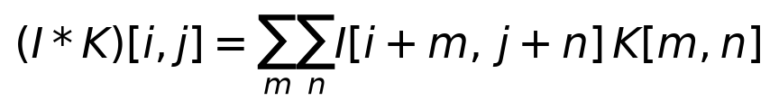
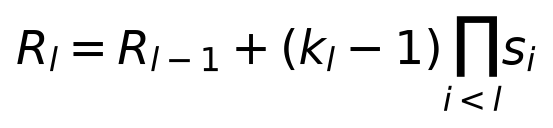
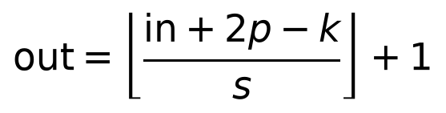
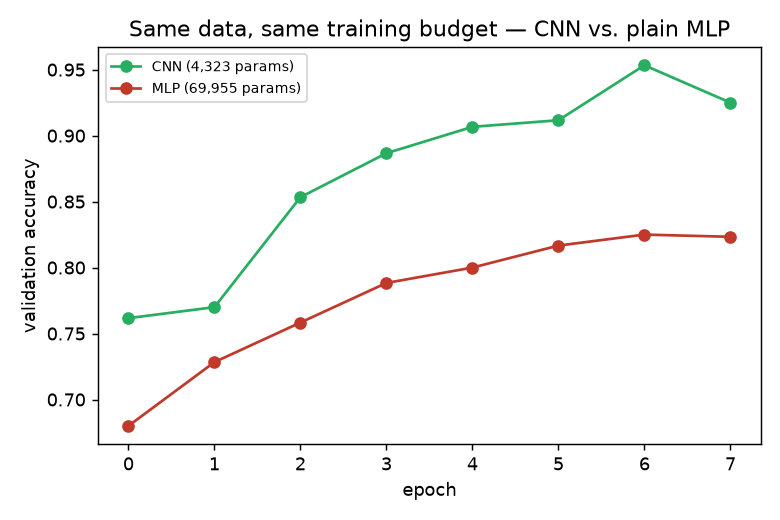
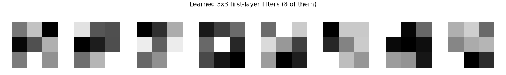

# Day 7 — Convolutional Neural Networks: the Right Inductive Bias for Images

**Goal today:** understand convolution as a *deliberate constraint* on a
fully-connected layer — one that happens to match how images actually
work — and see that constraint pay off directly in parameter count and
accuracy on the same task.

**Code:** `code/train_cnn_vs_mlp.py`. **Dataset:** `make_shape_images`
(circle/square/triangle, 32×32 grayscale, `../_shared/synthetic_data.py`)
— see Day 1's insight: because we generated this data ourselves, we know
exactly what the "true" classification rule is (shape identity), so any
gap between train and real performance is unambiguous, not a data-quality
question.

---

## 1. Convolution: one formula, two consequences

A 2D convolution (in deep learning, almost always actually
*cross-correlation* — no kernel flipping, despite the name) slides a small
learnable kernel `K` over an image `I`, computing a weighted sum at every
position:



Two properties fall directly out of this one formula, and both are the
whole reason CNNs exist:

- **Parameter sharing.** The *same* kernel `K` is used at every spatial
  position. A fully-connected layer on a 32×32 image would need a
  separate weight for every (input pixel, output unit) pair; a 3×3
  convolution needs only 9 weights (per input/output channel pair),
  reused everywhere. This is a direct, checkable number, not a vague
  claim — see §3.
- **Translation equivariance.** Because the same kernel is applied
  everywhere, shifting the input shifts the output detection by the same
  amount — a circle detector that fires on a circle in the top-left will
  fire identically on that same circle moved to the bottom-right. A plain
  MLP has no such guarantee: a hidden unit that learned to recognize a
  circle at one pixel location has learned nothing, structurally, about
  recognizing it elsewhere — it would need to see (and separately learn
  from) examples at every location.

## 2. Pooling and receptive field

`nn.MaxPool2d(2)` halves spatial resolution by keeping only the maximum
value in each 2×2 window — this buys a small amount of translation
*invariance* on top of convolution's *equivariance* (a feature detected
slightly off-position still survives, since the max over a small window
absorbs small shifts) and reduces computation for every layer that
follows.

Stacking convolutions grows each unit's **receptive field** — the region
of the *original* input image that can influence it:



Each additional layer's receptive field depends on its own kernel size
and the *product* of every previous layer's stride. This compounding is
why deep CNNs can recognize large, complex patterns (a whole face, a
whole object) using only small 3×3 kernels throughout — depth, not kernel
size, is what lets a network "see" a large region.

Output spatial size after a conv/pool layer follows directly from kernel
size, padding, and stride:



`padding=1` with a 3×3 kernel and `stride=1` keeps spatial size unchanged
(`⌊(in+2−3)/1⌋+1 = in`) — the padding convention `train_cnn_vs_mlp.py`
uses throughout, so only the explicit `MaxPool2d(2)` layers change spatial
size (32→16→8).

## 3. CNN vs. MLP, same data, same budget: the actual numbers

`code/train_cnn_vs_mlp.py` trains a small 2-conv-layer CNN and a
2-hidden-layer MLP on the *identical* 2,400 training images (shape
classification), same 8 epochs, same optimizer:

```
CNN params: 4,323
MLP params: 69,955
```



The CNN — with **16x fewer parameters** — reaches noticeably higher
validation accuracy, faster, than the MLP. This is not a fluke of this
particular run; it's the direct, measurable consequence of §1's two
properties: the CNN doesn't have to *re-learn* "what a circle's edge looks
like" separately for every possible position in the image, so it spends
its (much smaller) parameter budget more efficiently. The MLP has to
implicitly learn a form of position-specific pattern detection from raw
pixel-to-hidden-unit weights, with no structural help — more parameters,
worse result, same data.

### What the first layer actually learns



Each of these 3×3 tiles is one trained convolutional kernel, visualized
as a grayscale image. At this tiny kernel size you're looking at
low-level primitives — directional light/dark gradients, edge-orientation
detectors — "generic first-layer features" in the sense that this exact
pattern shows up regardless of the final task. This isn't a coincidence: early
convolutional layers converging on edge/gradient detectors is one of the
most consistent, well-documented findings across essentially every CNN
ever trained on natural images, regardless of the final task — a strong
piece of evidence that this really is the useful primitive-feature
vocabulary for visual data.

---

## Library notes: `nn.Conv2d`, `nn.MaxPool2d`, image tensor conventions

- **`nn.Conv2d(in_channels, out_channels, kernel_size, padding=..., stride=...)`**
  — weight shape is `[out_channels, in_channels, kH, kW]`. `out_channels`
  is how many *independent* kernels this layer learns — each produces one
  output feature map, so the layer's output has `out_channels` channels
  regardless of how many input channels it started with.
- **PyTorch's image tensor convention is `NCHW`**: `[batch, channels,
  height, width]` — different from some other libraries (and from
  matplotlib/PIL, which use `HWC`). `make_shape_images()` already returns
  `[n, 1, size, size]` in this convention for exactly this reason; if you
  ever load images another way, watch for this mismatch — it's a common
  source of silent shape-related bugs (or worse, a *successfully running*
  but semantically wrong forward pass, e.g. treating spatial dimensions as
  channels).
- **`nn.MaxPool2d(kernel_size)`** has no learnable parameters — it's a
  fixed downsampling rule. `nn.AvgPool2d` is the averaging alternative;
  max pooling is more common in classification CNNs because it preserves
  the *strongest* activation of a feature detector in each window, which
  tends to matter more for "is this pattern present" than the average
  response does.
- **`nn.Flatten()`** reshapes `[batch, C, H, W]` to `[batch, C*H*W]` —
  the standard bridge between a convolutional feature extractor and a
  fully-connected classifier head, used in both `SmallCNN` and (on raw
  pixels) `PlainMLP` above.

---

## Exercises

1. Change the CNN's first `Conv2d` from a 3×3 to a 5×5 kernel (adjust
   `padding` to keep spatial size the same: `padding=2`) — how does the
   parameter count change, and does accuracy change with it?
2. Remove both `MaxPool2d` layers and retrain — the flattened feature map
   is now much larger going into the final `Linear`. How does parameter
   count and accuracy compare to the pooled version?
3. Using the output-size formula, compute by hand what spatial size a
   96×96 input would reach after three `Conv2d(kernel_size=3, padding=1)`
   followed by `MaxPool2d(2)` blocks in a row, then verify your answer by
   running a dummy tensor through such a stack in code.

**Next:** Day 8 goes from a from-scratch small CNN to real architectural
ideas that made *very* deep CNNs trainable (residual connections) and
shows how to reuse a pretrained network's learned features instead of
training from scratch every time.
