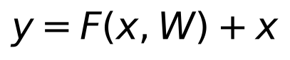
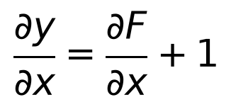
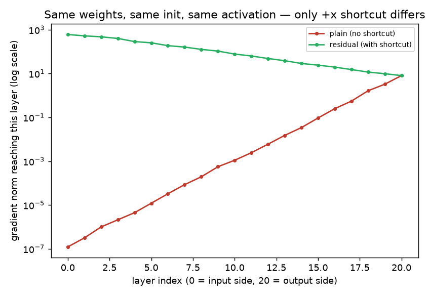

# Day 8 — Residual Connections and Transfer Learning

**Goal today:** see a third, purely architectural fix to the running
vanishing-gradient story (Days 4, 6), and use a real pretrained network's
learned features on a task it was never trained for — with an honest
measurement of how much that pretraining actually buys you.

**Code:** `code/residual_gradient_flow.py`, `code/transfer_learning_shapes.py`

---

## 1. The residual connection: one `+x`, a fundamentally different gradient path

A residual ("skip connection") block computes:



instead of the plain `y = F(x, W)`. This single addition changes the
*local* gradient of the block from whatever `∂F/∂x` happens to be, to:



**The `+1` is the entire insight.** In a plain deep stack, the gradient
reaching an early layer is a *product* of many `∂F/∂x` factors — and if
any of those factors are small (as Days 4/6 showed happens easily), the
product shrinks toward zero no matter how many layers you have. With a
residual connection, every block's local gradient has an unconditional
`+1` term, so **the gradient can always flow backward through the
identity path even if `∂F/∂x` itself is near zero.** This doesn't just
help — Day 4/6's activation and initialization fixes were both about
making `∂F/∂x` *itself* well-behaved; residual connections sidestep the
problem structurally, by giving the gradient a path that doesn't depend
on `∂F/∂x` being well-behaved at all.

### Proof, holding everything else at its *worst* setting from Day 6

`code/residual_gradient_flow.py` deliberately reuses the exact
worse-performing configuration from Day 6 (ReLU + PyTorch's *default*
initialization, not He/Kaiming) — the setting that vanished hardest — and
compares a plain 20-layer stack against the identical stack with `+x`
shortcuts added:



```
plain    stack: grad norm at input-side layer = 1.22e-07
residual stack: grad norm at input-side layer = 5.99e+02
```

The plain stack reproduces Day 6's vanishing result exactly (same
init, same problem). The residual stack's gradient doesn't just survive —
it's *larger* at the input side than the output side, because the
identity paths let every layer's local contribution add up rather than
multiply and shrink. **This is why ResNet-style architectures can be
trained successfully at depths (50, 100+ layers) that plain stacks simply
cannot reach**, and it's a genuinely different mechanism from Day 6's
initialization fix — in production architectures, both are used together
(He init *and* residual connections), not one instead of the other.

## 2. Transfer learning: reusing what a network already learned

Training a large CNN from scratch needs a lot of data and compute.
**Transfer learning** instead starts from a network already trained on a
large, different dataset (`ResNet18` trained on ImageNet: 1.28M real
photographs, 1000 object classes) and adapts it to a new task — here, our
3-class synthetic shapes, a domain ImageNet never saw.

### Bridging the domain gap is not optional bookkeeping

ImageNet models expect 3-channel, roughly 224×224 input, normalized to
ImageNet's specific per-channel mean/std. Our synthetic images are
1-channel, 32×32, in `[-1, 1]`. `preprocess_for_resnet()` handles this
explicitly:

```python
x = x.repeat(1, 3, 1, 1)                                  # 1 channel -> 3 (duplicate)
x = F.interpolate(x, size=224, mode="bilinear", ...)       # 32px -> 224px
x = (x - imagenet_mean) / imagenet_std                     # match training distribution
```

**This isn't a toy-example-only step.** Any time you reuse a pretrained
model on data that doesn't exactly match its original input format —
different channel count, resolution, or normalization statistics — you
must replicate whatever preprocessing the original model was trained
with. Mismatched normalization is a common, quiet source of "the
pretrained model performs badly for no clear reason" bugs.

### Freezing the backbone, training only a new head

```python
for p in backbone.parameters():
    p.requires_grad = False          # backbone weights never update
backbone.fc = nn.Linear(backbone.fc.in_features, 3)   # new head, trainable by default
```

Setting `requires_grad = False` doesn't just skip *updating* those
parameters — it also means autograd doesn't need to compute or store
gradients through the frozen backbone's internals at all, saving real
memory and compute during backward. The new `fc` layer is a fresh
`nn.Linear`, created *after* the freeze loop, so it defaults to
`requires_grad=True` and is the only thing the optimizer touches.

### Isolating how much "pretrained" actually buys you

The experiment holds the architecture, the freezing strategy, the new
head, and the training procedure completely fixed, and changes only
whether the backbone started from ImageNet weights or random weights:

```
(a) pretrained backbone, frozen: val_acc 0.642 -> 0.983 over 5 epochs
(b) random backbone,     frozen: val_acc 0.325 -> 0.483 over 5 epochs
```

**Both models only ever train the same small head** — a `Linear(512, 3)`
— on the same frozen-backbone features. The gap (98.3% vs 48.3%) is
entirely attributable to *what the backbone's convolutional filters
learned to detect*: general-purpose visual primitives (edges, textures,
shapes, contours — the same kind of low-level features Day 7's tiny CNN
also converged toward) turn out to be useful even on synthetic geometric
shapes ImageNet never contained a single example of. This is the concrete
argument for transfer learning: the low/mid-level visual vocabulary a
large network learns from millions of natural images turns out to
generalize far beyond the specific classification task it was trained on.

**Two modes worth distinguishing, both real options in practice:**
**feature extraction** (what this experiment does — freeze the backbone,
train only a new head, cheap and fast) vs. **fine-tuning** (unfreeze some
or all of the backbone too, train it further at a *small* learning rate
so pretrained weights aren't destroyed by large early gradients from an
untrained head) — fine-tuning usually reaches higher accuracy when your
new dataset is reasonably large, at the cost of more compute and a real
risk of "catastrophic forgetting" the pretrained features if the learning
rate is too high.

---

## Library notes: `torchvision.models`

- **`torchvision.models.resnet18(weights=ResNet18_Weights.IMAGENET1K_V1)`**
  downloads (once, then caches in `~/.cache/torch/hub/checkpoints/`, ~45MB
  for ResNet18) a full architecture + pretrained weights in one call.
  Passing `weights=None` gives you the identical architecture with fresh
  random initialization — exactly what `build_model(pretrained=False, ...)`
  uses above to isolate the pretraining effect.
- **Inspecting/replacing the head**: every `torchvision` classification
  model exposes its final layer under a predictable attribute name
  (`.fc` for ResNet, `.classifier` for VGG/MobileNet/EfficientNet-family
  models) — check the model's `__repr__` (just `print(model)`) if unsure;
  replacing that one attribute with a fresh `nn.Linear` of the right
  output size is the standard adaptation pattern for any new number of
  classes.
- **`p.requires_grad = False`** works on any parameter, individually or
  in a loop over `model.parameters()` — there's no separate "freeze" API;
  it's the same flag from Day 2, just set explicitly after model
  construction instead of left at its default.
- **`F.interpolate(x, size=..., mode="bilinear")`** (from
  `torch.nn.functional`) resizes a batch of feature maps or images
  differentially — unlike `torchvision.transforms.Resize` (which operates
  on PIL images or single tensors outside a training loop), `F.interpolate`
  is a proper differentiable tensor operation you can call inline on a
  GPU batch, which is why it's used here rather than a transform.

---

## Exercises

1. In `residual_gradient_flow.py`, change the shortcut from `h = h +
   act(lin(h))` to a *scaled* shortcut `h = 0.5 * h + act(lin(h))` — does
   the gradient still avoid vanishing as effectively? What does this
   suggest about why real ResNets use a clean, unscaled identity path?
2. In `transfer_learning_shapes.py`, unfreeze the backbone (remove the
   `requires_grad = False` loop) and retrain the pretrained model at a
   *much* smaller learning rate (e.g. `lr=1e-5`) for the backbone
   specifically (hint: `torch.optim.Adam` accepts per-parameter-group
   learning rates) — does full fine-tuning beat frozen feature
   extraction here?
3. Swap `ResNet18` for `torchvision.models.mobilenet_v3_small` (a much
   smaller pretrained model, useful to know exists when disk/compute is
   constrained) and rerun the frozen-backbone comparison — note this
   model's head attribute has a different name than `.fc`.

**Next:** Day 9 leaves images behind for sequences — RNNs and LSTMs, why
plain RNNs suffer their own version of the vanishing-gradient problem
across *time* instead of depth, and what LSTM's gating mechanism does
about it.
