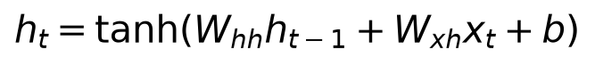
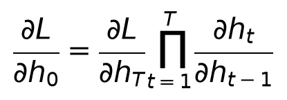
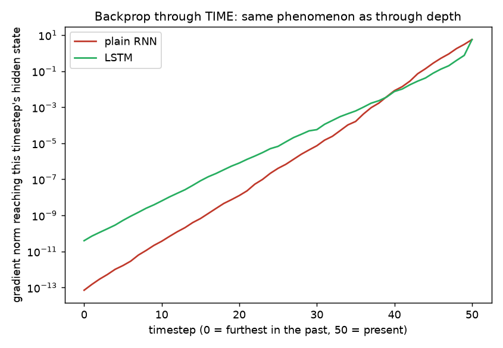
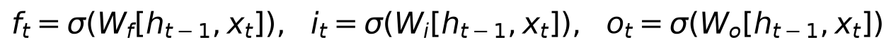
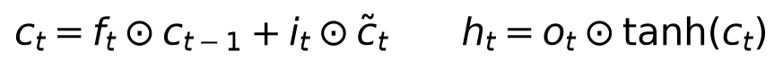
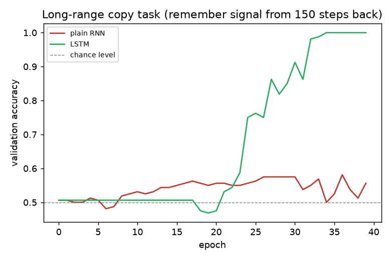

# Day 9 — RNNs and LSTMs: Vanishing Gradients Across Time

**Goal today:** recognize that "vanishing gradients" isn't a depth-specific
problem — it's a *repeated-multiplication* problem, and recurrent networks
hit it across **time** the same way deep stacks hit it across **depth**
(Days 4, 6, 8). See LSTM's gating mechanism as, again, an additive
shortcut in the same family as Day 8's residual connection.

**Code:** `code/rnn_vs_lstm.py`

---

## 1. The recurrence: one set of weights, reused at every timestep



Notice `W_hh` and `W_xh` don't have a time index — the **same** weights
process every timestep. This is parameter sharing again (Day 7's
convolution insight, now shared across *time* instead of *space*): an RNN
trained on sequences of length 20 can, structurally, run on a sequence of
length 200 with no new parameters, because it's applying the identical
learned update rule at every step.

## 2. Backpropagation Through Time (BPTT) is just the chain rule, unrolled

Training an RNN means "unrolling" the recurrence into a chain exactly like
a very deep feedforward network — timestep 50's hidden state depends on
timestep 49's, which depends on 48's, and so on. The gradient reaching the
*first* hidden state is a product of many per-step Jacobians:



This is **structurally identical** to Day 4's backprop recursion and
Days 6/8's depth-wise vanishing-gradient analyses — the only difference is
that "layer index" has become "timestep index." Everything you already
know about why products of many small (or large) factors shrink toward
zero (or blow up) applies directly here.

### Measuring it, the same way Days 4/6/8 did

`code/rnn_vs_lstm.py` unrolls a plain RNN and an LSTM for 50 timesteps
and measures the gradient norm reaching each earlier hidden state:



```
RNN : grad norm at t=0 (50 steps back) = 7.06e-14
LSTM: grad norm at t=0 (50 steps back) = 3.95e-11
```

Both shrink substantially over 50 steps — this is a hard problem — but
**LSTM's gradient is roughly 1,600x larger** at the furthest-back
timestep, a real, measurable difference from the same architecture-only
change explored below.

## 3. LSTM: gates, and an additive cell state (Day 8's `+x` trick again)




Three gates — **forget** (`f_t`, how much of the old cell state to keep),
**input** (`i_t`, how much of the new candidate value `c̃_t` to add), and
**output** (`o_t`, how much of the cell state to expose as the hidden
state) — all computed by small sigmoid networks looking at the previous
hidden state and current input.

**The insight that connects directly to Day 8:** look at the cell-state
update — `c_t = f_t ⊙ c_{t-1} + i_t ⊙ c̃_t`. This is an *additive* update
to `c_{t-1}`, not a full replacement the way the plain RNN's `h_t =
tanh(...)` recomputes the hidden state entirely from scratch every step.
When `f_t ≈ 1` (the forget gate stays open), the cell state's gradient
path backward through time is dominated by that `+` — structurally the
same mechanism as Day 8's residual `y = F(x) + x`, just unrolled across
time instead of depth. LSTM doesn't eliminate the vanishing-gradient
problem; it gives the gradient an additive shortcut that *can* stay open,
the same way a residual connection does, controlled by a learned gate
instead of being permanently fixed open.

## 4. A genuinely honest finding: task difficulty determines whether this matters in practice

`rnn_vs_lstm.py`'s "long-range copy" task hides one bit of signal at
position 0 of a sequence and asks the model to recover it at the final
timestep, after many steps of pure noise — a direct test of whether a
model can *carry* information across a long gap.

**The first version of this experiment (40-100 noisy steps, small noise
magnitude) showed no difference at all — both architectures reached 100%
accuracy.** This is worth reporting honestly rather than hiding: modern
optimizers (Adam, used throughout this course) are considerably more
robust to the vanishing-gradient problem than the plain SGD used when
LSTM was originally proposed in 1997, and a sufficiently short or
low-noise sequence doesn't stress the mechanism enough to matter. Only
after increasing to **150 steps with larger noise** did a real gap appear:



```
rnn : final val acc on 150-step long-range copy task = 0.556  (barely above chance)
lstm: final val acc on 150-step long-range copy task = 1.000
```

The plain RNN never clearly escapes chance level (0.5) across 40 epochs of
training. The LSTM sits at chance for about 20 epochs — consistent with
gates needing to learn *when* to stay open before the signal can actually
propagate — then rapidly climbs to 100% once they do. **The lesson here is
about experimental honesty as much as about RNNs**: an architectural
advantage predicted by theory (§1-3) doesn't automatically show up in
every experiment; it shows up once the task is hard enough to actually
exercise the mechanism the theory is about. Finding that boundary is
itself part of understanding *when* the theory's prediction matters in
practice — the same spirit as Day 4's honest ReLU-vanishing-gradient
finding.

### A practical training detail worth knowing: forget-gate bias initialization

`RNNClassifier` explicitly initializes the LSTM's forget-gate bias to `1`
(PyTorch's default is `0`), a well-documented trick (Jozefowicz et al.,
2015): starting the forget gate open ("remember by default") rather than
at a neutral 0.5 gives the gradient a clear path from the very first
training step, instead of requiring the network to first discover that
keeping the gate open is useful. This single line measurably improved
training stability in developing today's demo — a concrete example of how
a seemingly minor initialization choice (echoing Day 6) can matter as
much as the architecture itself.

---

## Library notes: `nn.RNN`, `nn.LSTM`, `nn.RNNCell`/`nn.LSTMCell`

- **`nn.RNN(input_size, hidden_size, batch_first=True)`** processes an
  *entire* sequence in one call: `out, h_n = rnn(x)` where `x` is
  `[batch, seq_len, input_size]` (with `batch_first=True`; PyTorch's
  historical default is `[seq_len, batch, input_size]` — always check
  this when debugging shape errors) and `out` contains every timestep's
  hidden state, `h_n` only the final one.
- **`nn.RNNCell`/`nn.LSTMCell`** process *one* timestep at a time, taking
  the previous hidden (and cell, for LSTM) state explicitly and returning
  the new one — used in today's gradient-measurement code specifically
  because manually looping lets us call `.retain_grad()` on every
  intermediate hidden state, which the fused `nn.RNN`/`nn.LSTM` don't
  expose.
- **`nn.GRU`** (not covered in depth today, worth knowing it exists): a
  simplified gating scheme (2 gates instead of LSTM's 3, no separate cell
  state) that's often nearly as effective with fewer parameters — a
  reasonable default to try alongside LSTM in practice.
- **Gradient clipping** (`torch.nn.utils.clip_grad_norm_`, previewed here,
  covered fully in Day 14): RNNs are prone to *exploding* gradients as
  well as vanishing ones (the same repeated-multiplication mechanism, just
  with factors greater than 1 instead of less than 1) — clipping the
  gradient norm before `optimizer.step()` is close to mandatory for RNN
  training in practice, more so than for feedforward/CNN training.

---

## Exercises

1. Rerun `gradient_through_time` with `seq_len=100` instead of 50 — does
   LSTM's advantage over plain RNN (as a ratio) grow, shrink, or stay
   roughly the same?
2. Remove the forget-gate bias initialization and rerun the 150-step copy
   task — does LSTM still reach 100%, and if so, does it take longer
   (more epochs) to get there?
3. Try the copy task at `seq_len=250` — does the plain RNN's accuracy
   drop further below where it was at 150? Does LSTM's training curve
   shift later (needing more epochs before it "finds" the solution)?

**Next:** Day 10 introduces attention — a mechanism that sidesteps the
sequential bottleneck entirely by letting every position look directly at
every other position, with no chain of hidden states to propagate a
gradient through at all.
