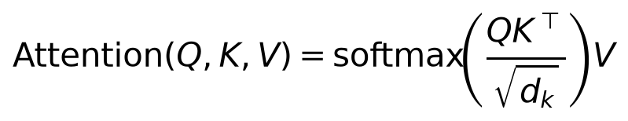
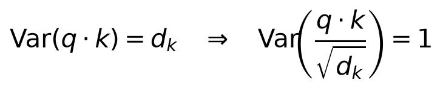
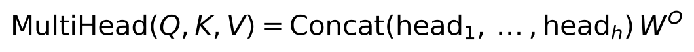
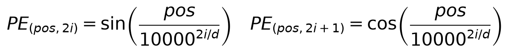
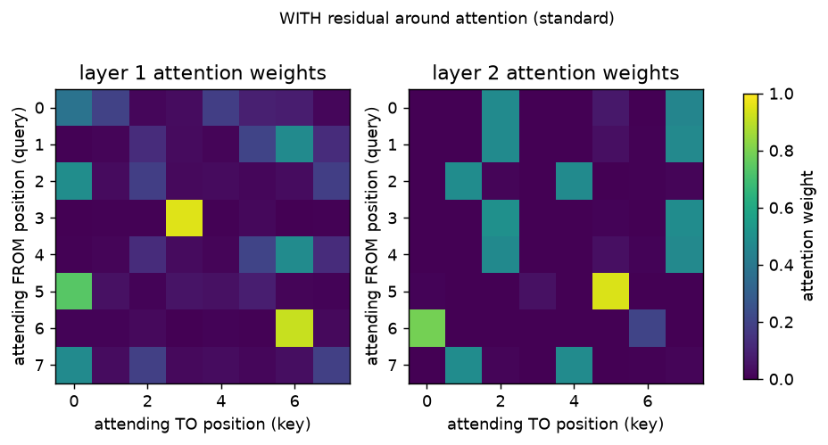
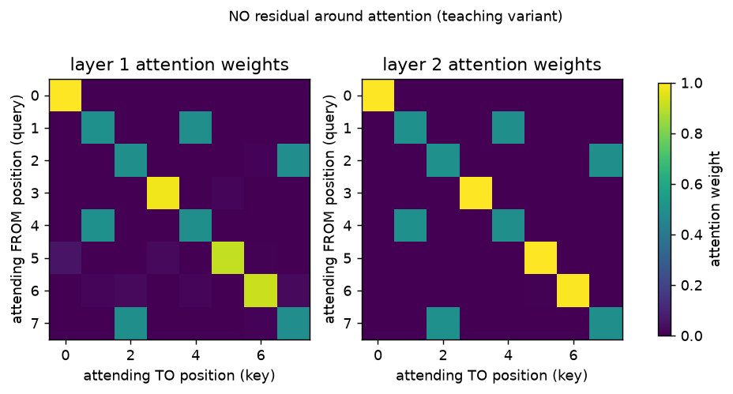

# Day 10 — Attention and Transformers

**Goal today:** implement the mechanism that replaced recurrence in most
modern sequence models, understand why it sidesteps Day 9's
across-time vanishing-gradient problem entirely, and see — with a real
experiment, not an assumption — exactly what determines whether attention
weights end up looking like the clean textbook diagonal.

**Code:** `code/attention_from_scratch.py`. **Dataset:**
`make_copy_task` (Day 9's synthetic sequence data, `../_shared/synthetic_data.py`).

---

## 1. Scaled dot-product attention

Every position produces a **query** (`Q`, "what am I looking for"), and
every position (including itself) offers a **key** (`K`, "what do I
contain") and a **value** (`V`, "what do I actually pass along if
selected"). `QKᵀ` computes a similarity score between every query and
every key; softmax turns each query's row of scores into a probability
distribution over positions to attend to; that distribution weights a sum
over the values. **Every output position can look directly at every input
position in one step** — no chain of hidden states to pass information
through, unlike Day 9's RNN.

### Why divide by `√d_k`?

If each component of `q` and `k` is roughly unit-variance and
independent, their dot product `q·k` (a sum of `d_k` such
independent products) has variance that **grows with `d_k`** — for large
`d_k`, raw dot products can be large in magnitude, pushing softmax into a
regime where its gradient is nearly zero (one input dominates completely,
the rest get essentially zero probability and zero gradient). Dividing by
`√d_k` keeps the pre-softmax scores at roughly unit variance regardless
of dimensionality — a normalization choice for the same *reason* Day 6's
weight initialization schemes exist: keeping a quantity's scale controlled
so gradients stay well-behaved.

### Multi-head attention

Instead of one attention computation with the full `d_model` dimensions,
split into `h` smaller "heads," each computing attention independently in
a lower-dimensional subspace, then concatenate and project back.
**Insight:** this lets different heads specialize — one head might learn
to attend to the immediately preceding token, another to the subject of a
sentence regardless of distance, another to punctuation boundaries — the
same way Day 7's multiple convolutional channels each specialize in
detecting a different visual pattern. Today's from-scratch implementation
uses a single head throughout, to keep the mechanism itself the focus.

### Positional encoding — attention has no built-in sense of order

Attention treats input as a *set*, not a sequence — nothing about the
`QKᵀ` computation depends on position order at all. Sinusoidal positional
encodings (one specific, parameter-free choice among several used in
practice) add a fixed, position-dependent pattern to each input embedding
before attention, giving the model the *information* it needs to
reconstruct order, even though the attention operation itself remains
order-agnostic. Today's implementation uses a simpler learned positional
embedding (`nn.Parameter`) instead — functionally similar, simpler to
implement, and common in practice (e.g. BERT).

## 2. What actually determines the "textbook diagonal" — a real experiment, not an assumption

`code/attention_from_scratch.py` trains a tiny 2-layer self-attention
model on the **copy task** (output the input sequence, unchanged — trivial
for attention if it learns "position `i`'s output should attend
to position `i`'s input"). The natural expectation is a clean diagonal
attention pattern. **Testing this directly revealed something more
specific than that expectation:**

With the **standard** transformer design (a residual connection around
the attention sub-layer, per Day 8 — `x = x + attention(x)`), both models
reach 100% token accuracy, but the attention weights are **not** cleanly
diagonal — some positions show diagonal-ish peaks, others are diffuse
across several positions. **Why**: the residual connection already
carries each position's own embedding forward unconditionally (`+x`), so
attention doesn't *have* to encode "copy my own position" — the residual
highway (identical mechanism to Day 8) already does that job for free,
leaving attention free to spend its capacity elsewhere while the model
still solves the task perfectly.

To directly test this explanation, `train_and_plot(attn_residual=False)`
removes *only* the residual connection around attention (keeping the
feedforward sub-layer's residual, and keeping everything else — data,
seeds, training procedure — identical):

**With that one change, both layers snap into a nearly perfect diagonal.**
Removed of its free identity shortcut, attention is now the *only* path
that can carry position `i`'s content to output `i`, and it learns to do
exactly that.

**The lesson generalizes beyond this specific experiment**: attention
weight patterns are not a direct readout of "what the model is doing" in
isolation — they reflect what attention needs to contribute *given*
everything else in the architecture (residual paths, other layers) that's
also carrying information forward. This is a genuinely important caveat
for interpreting real attention-visualization figures (common in
transformer papers) — a non-diagonal or diffuse attention pattern doesn't
necessarily mean the model failed to learn positional structure; it may
mean another pathway is already handling it.

## 3. Closing Day 9's loop: attention's gradient path length

Day 9 showed an RNN's gradient from the final timestep to an early one
must pass through every intermediate timestep — a chain of length
proportional to the distance between them. In self-attention,
**every output position connects to every input position through exactly
one `softmax(QKᵀ/√d)V` computation, regardless of how far apart they
are** — the path length between any two positions is `O(1)`, not `O(n)`.
This is *why* transformers don't suffer Day 9's across-time vanishing-
gradient problem: there is no long chain to vanish across in the first
place. The tradeoff, not a free lunch: computing `QKᵀ` is `O(n²)` in
sequence length (every position compares against every other), versus an
RNN's `O(n)` sequential steps — attention trades a gradient-flow problem
for a compute/memory problem, which is its own active area of
optimization in modern architectures (e.g. FlashAttention, sparse
attention patterns) beyond this course's scope.

---

## Library notes: implementing attention, and `nn.MultiheadAttention`

- **`Q @ K.transpose(-2, -1)`** — batched matrix multiply over the last
  two dimensions; PyTorch's `@` operator (and `torch.matmul`) applies to
  any leading batch dimensions automatically, which is why
  `scaled_dot_product_attention` above works unchanged whether `Q` is
  `[seq_len, d_k]` or `[batch, seq_len, d_k]`.
- **`torch.softmax(scores, dim=-1)`** — the dimension argument matters: we
  want each *query's row* of scores (one row per query, one column per
  key) to sum to 1, i.e. softmax over the *last* dimension (keys), not
  over queries.
- **`nn.MultiheadAttention(embed_dim, num_heads, batch_first=True)`** is
  PyTorch's built-in, production version of everything implemented by
  hand today — handles the multi-head splitting/concatenation and
  supports optional masking (for causal/autoregressive attention, where
  position `i` may only attend to positions `≤ i`, essential for
  language-model-style generation, not covered today). Once the from-
  scratch mechanics feel solid, prefer the built-in for real work — it's
  more heavily optimized (and, on supported hardware, dispatches to
  fused kernels like FlashAttention automatically).
- **`nn.TransformerEncoderLayer`/`nn.TransformerEncoder`** bundle
  multi-head attention + feedforward + residual connections + layer
  normalization into the standard full encoder block — the production
  equivalent of today's hand-rolled `TinySelfAttentionLayer`, with
  layernorm added (a normalization technique closely related to Day 6's
  BatchNorm, but normalizing across features for one example rather than
  across a batch — details in Day 14).

---

## Exercises

1. Add a **causal mask** to `scaled_dot_product_attention` (set scores to
   `-inf` wherever key position > query position, before the softmax) and
   confirm layer 1's attention plot now only has nonzero weight at or
   left of the diagonal — this is the mechanism that makes autoregressive
   generation (predict the next token using only past tokens) possible.
2. Increase `n_layers` from 2 to 4 in the no-residual variant — does the
   diagonal pattern remain clean in every layer, or does it degrade? What
   does that suggest about how many sub-layers can share one identity
   pathway before things get muddled without residual connections at all?
3. Implement true multi-head attention (split `d_model` into `h` chunks,
   run `scaled_dot_product_attention` on each chunk independently,
   concatenate) and verify total parameter count matches a single-head
   attention layer of the same `d_model` — multi-head splitting doesn't
   add parameters, only reorganizes how the same-sized projections are used.

**Next:** Day 11 leaves from-scratch implementations behind for one day
to work with the Hugging Face ecosystem — real pretrained transformer
models, tokenizers, and what actually changes (and doesn't) when you move
from a toy implementation to a production library.
