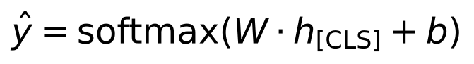

# Day 11 — The Hugging Face Ecosystem

**Goal today:** apply Day 8's transfer-learning pattern (freeze a
pretrained backbone, train a new head) to text, using a real pretrained
transformer rather than one trained from scratch — and understand what
subword tokenization is actually doing, since it's the one genuinely new
concept text models need that image models don't.

**Code:** `code/huggingface_finetune.py`. **Model:**
`google/bert_uncased_L-2_H-128_A-2` (Google's officially-maintained tiny
BERT: 2 layers, 128 hidden units, ~4.4M parameters, ~17MB) — chosen
deliberately small given this machine's disk constraints (see the course
root `README.md`); the mechanics here are identical for any BERT-family
model, only size differs.

---

## 1. Subword tokenization: why transformer vocabularies stay small

A word-level vocabulary would need an entry for every word that might
ever appear — impossible to make complete, since new words, typos, and
rare technical terms appear constantly. **WordPiece** (BERT's scheme;
GPT-family models use the closely related Byte-Pair Encoding) instead
builds a vocabulary of common sub-word *pieces*, and represents any word
as a sequence of pieces:

```
'deep learning'                       -> ['deep', 'learning']
'unbelievably'                        -> ['un', '##bel', '##ie', '##va', '##bly']
'supercalifragilisticexpialidocious'  -> ['super', '##cal', '##if', ..., '##ious']
```

Common whole words stay as single tokens; rare or unfamiliar words
decompose into pieces the vocabulary *does* contain (the `##` prefix
marks "this piece continues the previous token, don't insert a space").
**Insight:** this means the model never encounters a true out-of-
vocabulary word — worst case, an unfamiliar word becomes several small
pieces, and the model has *some* signal to work with (shared subword
pieces across related words), rather than a single opaque `<UNK>` token
carrying no information at all.

### What actually reaches the model

```
input_ids:      tensor([[ 101, 1996, 3185, 2001, 6581, 1012,  102]])
attention_mask: tensor([[1, 1, 1, 1, 1, 1, 1]])
decoded back:   [CLS] the movie was excellent. [SEP]
```

`101` and `102` are the special `[CLS]` (classification — a summary
position, more below) and `[SEP]` (separator, marking sequence
boundaries) tokens, automatically added by the tokenizer. `attention_mask`
marks which positions are real tokens vs. padding (all 1s here since this
example wasn't padded to match a batch) — this is exactly what Day 10's
attention mechanism needs to know which positions to actually attend to
when sequences in a batch have different lengths.

## 2. `[CLS]`-token classification: a text analogue of Day 8's image pooling

BERT-family models prepend a special `[CLS]` token to every input; after
passing through every transformer layer, that position's final hidden
state is trained (during BERT's original pretraining) to summarize the
*entire* sequence — because self-attention (Day 10) lets `[CLS]` attend to
every other position, it's well-positioned to aggregate whole-sequence
information. A classification head is then just:



— structurally identical to Day 8's `nn.Linear` head on top of a frozen
CNN backbone's pooled features. The entire novelty of applying transfer
learning to text, once you have the tokenizer handling text-to-ID
conversion, is *which* hidden state you read out (`[CLS]`, position 0)
rather than a global-average-pooled feature map.

## 3. Fine-tuning, frozen-backbone, exactly like Day 8

```python
self.backbone = AutoModel.from_pretrained(MODEL_NAME)
for p in self.backbone.parameters():
    p.requires_grad = False          # identical pattern to Day 8's frozen ResNet
self.head = nn.Linear(hidden, n_classes)
```

Trained on a small synthetic sentiment dataset (positive/negative
template sentences built from word banks — same "we know the true label
with certainty because we generated it" property Day 1 introduced):

```
epoch  0  val_acc 0.567
epoch  6  val_acc 0.933
epoch 14  val_acc 0.983
```

And, more convincingly than the held-out *validation* split (which is
drawn from the same templates as training): two **hand-written** sentences
using neither the exact templates nor exact vocabulary from training:

```
negative   'The staff were incredibly rude and slow.'
positive   'What a fantastic, memorable evening.'
```

Both correctly classified — genuine evidence the frozen pretrained
representation captures something about sentiment-bearing language in
general, not just the specific word list used to generate training data,
the same argument Day 8 made for ImageNet features transferring to
synthetic shapes.

---

## Library notes: `transformers`

- **`AutoTokenizer.from_pretrained(name)` / `AutoModel.from_pretrained(name)`**
  — the `Auto*` classes inspect the target repository's config and load
  the *correct* concrete tokenizer/model class automatically (BERT, GPT-2,
  RoBERTa, etc. all have different tokenizer/model implementations under
  the hood); you rarely need to import a model-specific class directly.
- **A real compatibility snag worth knowing about, since it will happen
  to you eventually**: not every community-uploaded checkpoint stays
  compatible with the newest `transformers` release — this project first
  tried `prajjwal1/bert-tiny` (a widely-referenced, popular tiny BERT) and
  it failed to load under this environment's `transformers` version (a
  missing `model_type` key the newer loader now requires, and a
  tokenizer format the newer "fast tokenizer" loader couldn't
  auto-convert). Switching to `google/bert_uncased_L-2_H-128_A-2` — the
  same architecture, officially maintained by Google — fixed both issues
  immediately. **The general lesson**: when a specific pretrained
  checkpoint fails to load, before assuming your code is wrong, check
  whether an actively-maintained equivalent exists; library version drift
  against older community uploads is common, not a sign you're doing
  something incorrectly.
- **`tokenizer(texts, padding=True, truncation=True, max_length=...,
  return_tensors="pt")`** in one call: tokenizes, pads every sequence in
  the batch to the same length (so they can stack into one tensor),
  truncates anything longer than `max_length`, and returns PyTorch tensors
  directly — `attention_mask` is generated automatically alongside
  `input_ids`, marking which positions are real content vs. padding.
- **`model.config`** exposes every architectural hyperparameter the
  checkpoint was built with (`hidden_size`, `num_hidden_layers`,
  `num_attention_heads`, ...) — `BertTinyClassifier` reads
  `backbone.config.hidden_size` rather than hardcoding `128`, so the same
  class would work unmodified with a larger BERT variant.
- **Not used today, worth knowing exists**: the `datasets` library
  (Hugging Face's companion to `transformers`, for loading/processing
  large text datasets efficiently) and the `Trainer` API (a configurable
  training loop that replaces the manual `for epoch in range(...)` loop
  used throughout this course, handling logging/checkpointing/evaluation
  scheduling for you) — this course writes training loops by hand
  throughout specifically so the mechanics stay visible; `Trainer` is
  worth adopting once those mechanics are second nature.

---

## Exercises

1. Unfreeze the backbone (remove the `requires_grad = False` loop) and
   fine-tune the *entire* model at a small learning rate (e.g. `2e-5` for
   the backbone, higher for the head — use PyTorch optimizer parameter
   groups) — does full fine-tuning reach higher validation accuracy, and
   does it still generalize to the hand-written test sentences?
2. Print `tokenizer.vocab_size` and compare it to the number of unique
   *words* across all templates in `make_toy_sentiment_data` — by how
   much smaller is the model's actual output space needed here versus
   BERT's full vocabulary?
3. Try mean-pooling over all non-padding token positions instead of using
   only `[CLS]` (`(last_hidden_state * attention_mask.unsqueeze(-1)).sum(1)
   / attention_mask.sum(1, keepdim=True)`) as the classification head's
   input — does it change validation accuracy on this task?

**Next:** Day 12 returns to from-scratch model-building with
autoencoders — compressing data into a learned latent representation, and
the probabilistic extension (VAEs) that makes that latent space usable
for generation, not just compression.
