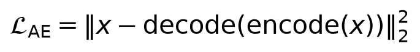
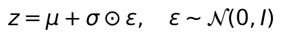
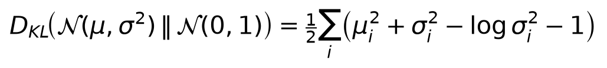
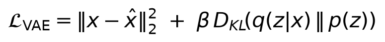
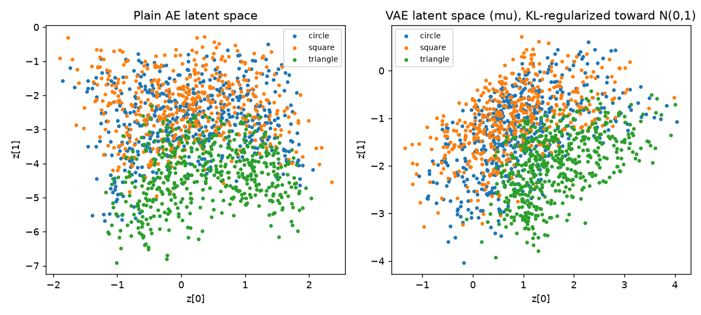
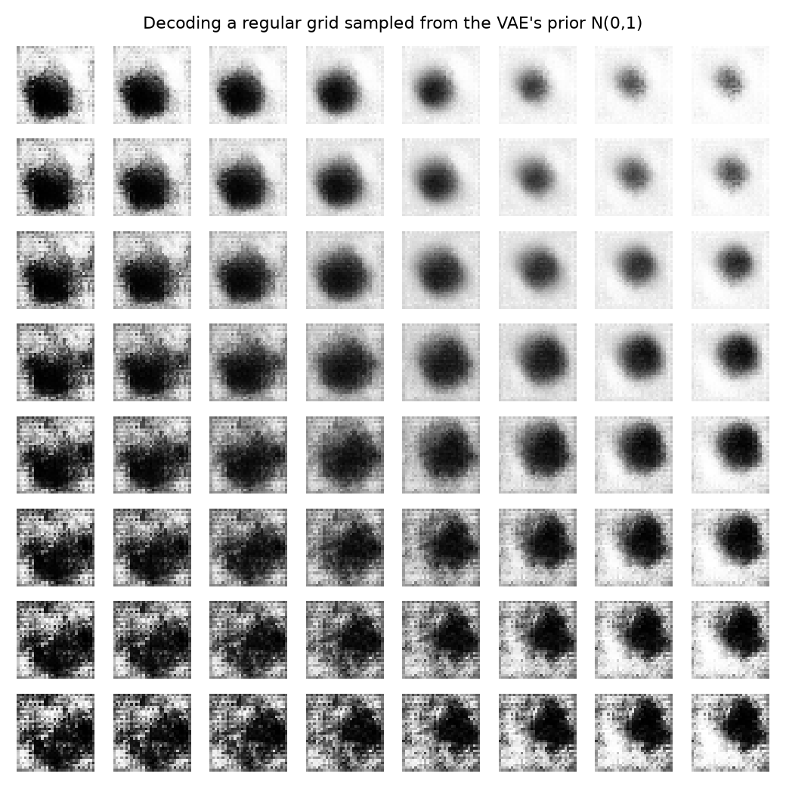

# Day 12 — Autoencoders and Variational Autoencoders

**Goal today:** understand a bottleneck architecture as forced
compression, then see exactly what one extra ingredient (a KL penalty
toward a known distribution) buys you: a latent space you can actually
*sample* from, not just encode into.

**Code:** `code/ae_vs_vae.py`. Both models use a **2D latent bottleneck**
deliberately — small enough to be an aggressive compression challenge,
and small enough to plot the entire latent space directly with no
dimensionality-reduction technique needed to visualize it.

---

## 1. The plain autoencoder: reconstruction forces compression

An autoencoder is an encoder (`x → z`, compressing to a low-dimensional
**latent code**) and a decoder (`z → x̂`, reconstructing), trained purely
to make the reconstruction match the input:



With a 2D bottleneck on 32×32 images (1,024 pixels compressed to 2
numbers), the network is forced to discard almost everything except the
most essential factors of variation — it cannot memorize pixel values
directly, so whatever it *does* preserve in those 2 numbers must be
genuinely useful for reconstruction. This is why autoencoders are a
classic unsupervised representation-learning tool: the bottleneck is the
entire mechanism, not an incidental detail.

## 2. The VAE's twist: encode a *distribution*, not a point

A plain AE's encoder outputs one fixed point `z` per input. A VAE's
encoder instead outputs the **parameters of a distribution** — a mean
`μ` and (log-)variance for a Gaussian — and samples `z` from it:



**Why sample via `μ + σ⊙ε` instead of directly sampling `z ~
N(μ, σ²)`?** Because sampling is not, by itself, a differentiable
operation — you can't backpropagate through a random draw. The
**reparameterization trick** rewrites the sample as a deterministic
function of `μ`, `σ`, and an *external* random number `ε` (drawn fresh
each time, but not something we need a gradient through) — `∇_μ` and
`∇_σ` can now flow through `z = μ + σε` exactly like any other
computation, because `ε` is just a constant from the perspective of that
gradient computation. This is a genuinely elegant trick worth sitting
with: it turns "backpropagate through randomness" into "backpropagate
through a deterministic function, with randomness injected as an
untouched input."

### The regularizer that makes the latent space usable

Training only for reconstruction would let the VAE's encoder shrink `σ`
toward zero and behave like a plain AE (defeating the purpose). The
**KL-divergence term** penalizes the encoded distribution for straying
from a fixed, known prior — standard normal, `N(0, I)`:



Combined, the full VAE objective (a lower bound on the data
log-likelihood, hence "ELBO" — Evidence Lower BOund — though we don't
derive that bound today, just use the resulting loss):



`β` (here `0.001`, deliberately small) controls the trade-off: too large
and the KL term dominates, crushing every input toward the same
uninformative `N(0,1)` code (reconstruction gets much worse); too small
and you drift back toward a plain AE's unstructured space. This tension
— often called the "β-VAE" trade-off in the literature — is a real,
hands-on hyperparameter decision, not a solved default.

## 3. What actually changes in the latent space — measured, not assumed

```
[AE]  epoch 14  recon_loss 0.1434
[VAE] epoch 14  recon_loss 0.1465  kl 6.5724
```



Both reach comparable reconstruction quality (VAE's is a hair higher,
consistent with the added KL pressure trading off against pure
reconstruction fidelity, exactly as the objective is designed to do).
The class clusters (circle/square/triangle, colored) are visible in both
— even the plain AE's *unregularized* space still organizes shapes by
similarity, since that's what's useful for reconstruction. **The
meaningful difference is scale and structure, not cluster separation**:
the VAE's space is pulled toward being centered and unit-scaled (the
`N(0,1)` prior's influence, visible in the tighter, more origin-centered
spread), while the plain AE's space has no such constraint and can drift
to arbitrary scale/location — nothing during plain-AE training penalizes
that.

### Sampling from the prior: the actual point of the KL term

Because the VAE was explicitly trained to keep its encoded distributions
close to `N(0,1)`, sampling a *new* `z` directly from `N(0,1)` — never
having encoded any real image — should decode into something
image-like. A plain AE's latent space has no such guarantee: an
arbitrary point could land in a region the decoder never learned to
reconstruct sensibly, since nothing during training ever pushed the
*encoder's* output distribution toward filling the space smoothly.



**Read honestly, not oversold**: at this 2D bottleneck size and 15
epochs, the decoded grid does not produce crisp, individually recognizable
circles/squares/triangles — the images are blob-like. What *is* clearly
visible, and is the actual point of this figure, is that **the outputs
vary smoothly and continuously as you move across the grid** — size,
blob-density, and shape gradually morph from cell to cell, with no
sudden discontinuities or garbage patches anywhere in the sampled 8×8
region. That smoothness is exactly what the KL term is responsible for:
every point in this region is a point the encoder was actively trained to
map *real* inputs near, so the decoder has seen (and learned to handle)
similar codes during training. A plain AE offers no such guarantee for an
arbitrary sampled point — this experiment (try it in the exercises) would
show visibly worse results, including regions that decode to pure noise.
Reaching crisper, more class-distinct samples is a matter of a larger
latent dimension, more training, and/or a better-tuned `β` — a direct,
predictable lever, not a fundamental limitation of the approach.

---

## Library notes: nothing new, composition of Days 4/6/7

Nothing in `ae_vs_vae.py` uses a library feature not already covered:
`nn.Conv2d`/`nn.ConvTranspose2d` (Day 7's convolution, `ConvTranspose2d`
being its "learned upsampling" counterpart — same parameter-sharing
logic, run in the spatially-expanding direction), `nn.Linear` (Day 3),
`torch.randn_like` (used for `ε` in the reparameterization trick — same
random-sampling API met throughout this course). **This is a deliberate
structural point for today**: VAEs are not a new set of primitives to
learn, they're a specific, principled *combination* of an architecture
choice (bottleneck) and a loss-function choice (reconstruction + KL) —
everything mechanical was already in your toolkit by Day 7.

---

## Exercises

1. Sample from the *plain AE's* latent space the same way
   (`vae_latent_grid.png`'s approach, but feeding grid points to `ae.decoder`
   instead) — do you see garbage/discontinuous patches that the VAE's
   grid didn't have?
2. Increase `beta` from `0.001` to `0.05` and retrain the VAE — does the
   latent space visually tighten further toward `N(0,1)`? What happens to
   `recon_loss`, and can you connect that tradeoff back to the ELBO
   equation directly?
3. Increase `LATENT` from 2 to 8 (you'll need a different visualization
   approach for the latent space itself, e.g. plotting just the first two
   dimensions, or skip that plot and focus on `vae_latent_grid.png`'s
   result) — does reconstruction quality improve, and do sampled grid
   images become more clearly shape-like?

**Next:** Day 13 looks at a different generative approach entirely — GANs,
which replace the VAE's explicit probabilistic loss with an adversarial
game between two networks, plus a conceptual introduction to diffusion
models, the mechanism behind most current state-of-the-art image
generators.
