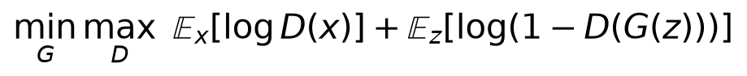
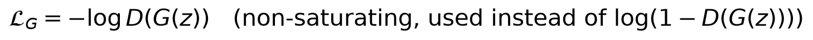
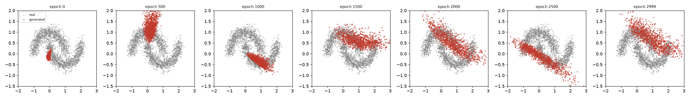
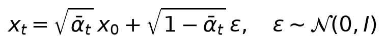
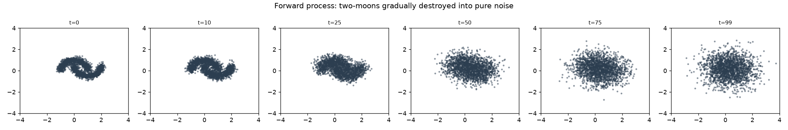
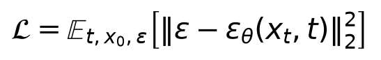
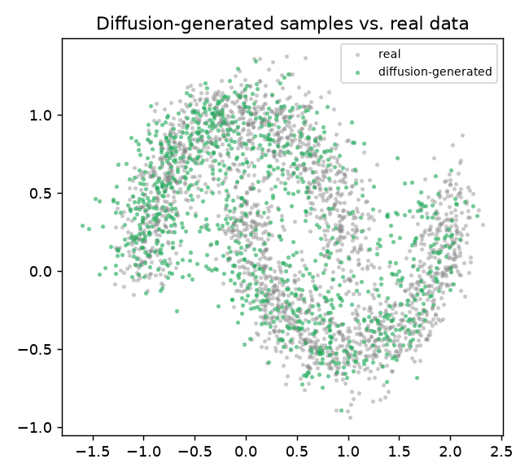

# Day 13 — Generative Adversarial Networks and Diffusion Models

**Goal today:** train two fundamentally different generative approaches
on the **identical** target distribution (two-moons, 2D — so both the
target and the generated output are fully visualizable, no
dimensionality reduction needed) and let a direct, honest comparison show
*why* diffusion models became dominant over GANs for high-stakes image
generation, rather than asserting it as received wisdom.

**Code:** `code/gan_2d.py`, `code/diffusion_2d.py`

---

## 1. GANs: an adversarial minimax game



Two networks, trained against each other: a **generator** `G` maps random
noise `z` to fake samples, trying to fool a **discriminator** `D` into
outputting high probability for them; `D` is trained simultaneously to
correctly separate real data from `G`'s fakes. Neither network is ever
"done" in isolation — each is chasing a constantly-shifting target (the
other network's current weights), which is precisely what makes GAN
training famously less stable than the loss-minimization problems in
every earlier day of this course.

### The non-saturating loss trick



Early in training, `G`'s samples are obviously fake, so `D(G(z))` is close
to 0 — but `log(1 - D(G(z)))`'s *gradient* is also close to zero exactly
there (it saturates), giving `G` almost no useful signal precisely when it
needs it most. Flipping to `-log(D(G(z)))` (equivalent to training `G` as
if the fake samples' label were 1, "fool the discriminator") has a much
stronger gradient in that same regime — a purely practical fix for a
training-dynamics problem, not a different mathematical game.

### What actually happened when trained



**Report this honestly, because it's the whole point of running the
experiment rather than asserting the outcome**: over 3,000 epochs, the
generator's output distribution never settles into a stable match for the
two crescents. It starts as a tight collapsed cluster (epoch 0, near
initialization), jumps to a *different* collapsed cluster (epoch 500),
another different one (epoch 1000), then spreads into an elongated
diagonal blob that partially overlaps the real data's span but never
resolves into two distinct crescent shapes, even by epoch 3000. **This
is a live demonstration of two well-documented GAN training pathologies**:
mode collapse (the generator committing to a narrow region of the target
distribution rather than covering it fully, especially visible in the
earlier snapshots) and simple non-convergence (`D` and `G`'s losses in
the printed log oscillate around similar values throughout training,
1.35-1.39 for `D`, 0.57-0.99 for `G`, never settling — evidence the
adversarial game never reaches a stable equilibrium here). This is not a
failed experiment; it is *the* standard, widely-reported behavior of GAN
training, reproduced directly rather than taken on faith.

## 2. Diffusion models: turn generation into iterative denoising

Instead of an adversarial game, diffusion models train a single network
with a single, ordinary, stable loss (mean squared error — Day 5) to
solve one well-defined prediction problem repeatedly.

### Forward process: destroy the data, on a fixed, known schedule



At every step `t`, a known amount of Gaussian noise is mixed in (`ᾱ_t`
shrinks from ~1 toward 0 as `t` increases) — there's nothing to learn
here, it's a fixed, closed-form corruption process:



By `t=99`, the two-moons structure has been completely destroyed into
pure `N(0,1)` noise.

### Reverse process: learn to undo one small noise step at a time

The network is trained on a single, simple task — given a noisy `x_t` and
the timestep `t`, predict the noise `ε` that was added:



This is **the same architecture-level idea as Day 12's VAE decoder,
trained with an ordinary reconstruction-style loss** — no adversarial
game, no two competing networks, just one network learning one
well-posed regression problem (Day 5's MSE, applied to noise vectors
instead of pixel values or class labels). To *generate* a new sample:
start from pure noise (`x_T ~ N(0,1)`) and repeatedly apply the trained
network's noise prediction to step slightly back toward `x_0`, one small,
well-defined denoising step at a time, for all `T=100` steps.

### What actually happened when trained — and the direct comparison

```
epoch    0  noise_pred_loss 1.0741
epoch 1999  noise_pred_loss 0.6188
```



Starting from pure noise and running the 100-step reverse process, the
generated points closely trace **both** crescents of the real
distribution — not a collapsed cluster, not a partial match, but a
recognizable, faithful reproduction of the actual two-moons shape. **Set
directly against §1's GAN result on the identical target distribution**,
this is a concrete, reproducible illustration of *why* diffusion models
displaced GANs as the dominant approach for high-fidelity generation:
diffusion training is an ordinary, stable supervised-regression problem
(one network, one loss, converges the same way every model in this course
has), while GAN training is an adversarial equilibrium-seeking process
that this exact experiment shows can fail to stabilize even on a
deliberately simple 2D target. **The tradeoff, not a free lunch**:
diffusion sampling required 100 sequential network evaluations to produce
one batch of samples here, versus the GAN's single forward pass through
`G` — diffusion trades training stability for a much heavier sampling
cost, an active area of research (fewer-step samplers, distillation) this
course doesn't cover further.

---

## Library notes: no new library surface today

Both scripts use only primitives from earlier days: `nn.Sequential` +
`nn.Linear` (Day 3-4), `nn.LeakyReLU` (a variant of ReLU that leaks a
small negative slope instead of hard-zeroing negative inputs — common
specifically in GAN discriminators, since it avoids the "dead ReLU"
failure mode, where a unit that always outputs zero also always has zero
gradient and can never recover, more likely to matter when training
signal is already unstable), `torch.randint`/`torch.randn` (sampling,
throughout this course), and `torch.cumprod` (used once, to build the
diffusion noise schedule's `ᾱ_t = ∏ α_i` from the per-step `α_t` values —
a cumulative product along a tensor dimension, the same operation family
as `torch.cumsum`).

---

## Exercises

1. In `gan_2d.py`, try training `D` for multiple steps per single `G`
   step (a common stabilization heuristic) — does the generated
   distribution's mode-collapse behavior improve?
2. In `diffusion_2d.py`, reduce `T` from 100 to 20 — does sample quality
   visibly degrade? This is a direct, hands-on look at the
   sampling-steps-vs-quality tradeoff mentioned above.
3. Plot the GAN discriminator's decision boundary (like Day 4's contour
   plots) at a late training epoch, overlaid with real and generated
   points — does it reveal anything about *why* the generator settled
   where it did?

**Next:** Day 14 shifts from architecture to engineering — mixed
precision, gradient accumulation, learning-rate schedules, and the
practical infrastructure that turns a working training loop into one that
scales to real datasets and real compute budgets.
