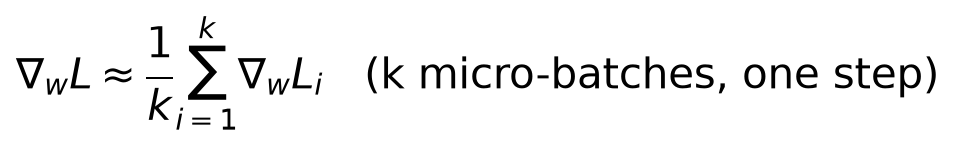
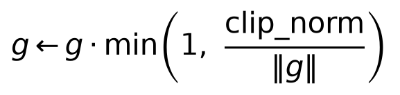
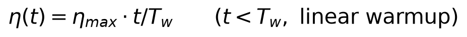
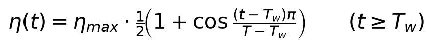
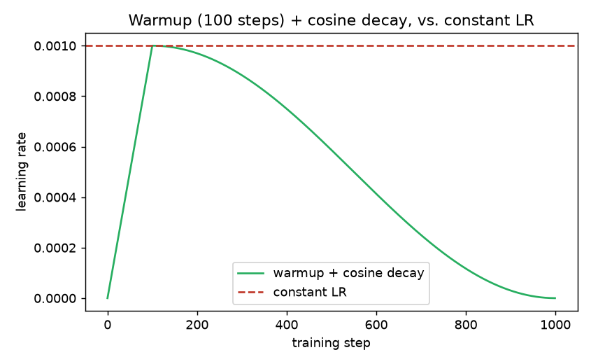

# Day 14 — Training at Scale: Precision, Accumulation, and Schedules

**Goal today:** the engineering layer that sits underneath every model
architecture covered so far — measured on this machine's actual GPU, not
asserted from a benchmark table.

**Code:** `code/scale_experiments.py`

---

## 1. Mixed precision: a real, measured speedup

Training normally computes in 32-bit floating point (`fp32`). Modern GPUs
(including this project's RTX 5090) have specialized **tensor cores**
that perform matrix multiplication substantially faster in 16-bit
(`fp16`/`bf16`) than in `fp32`. `torch.autocast` automatically runs
eligible operations (mostly matrix multiplies and convolutions — the
expensive ones) in `fp16` while keeping numerically sensitive operations
(reductions, loss computation) in `fp32`, and `torch.amp.GradScaler`
compensates for a real numerical risk this introduces: `fp16`'s much
smaller exponent range means small gradient values can **underflow to
exactly zero** during backpropagation. The scaler multiplies the loss by
a large factor before `.backward()` (making small gradients large enough
to survive `fp16`'s range) and divides back out before the optimizer
step — automatically, adjusting the scale factor if it detects overflow
(`inf`/`nan` gradients) instead.

**Measured on this machine, not claimed from a table:**

```
fp32 (full precision): 0.259s for 100 steps
AMP  (mixed precision): 0.181s for 100 steps
speedup: 1.43x
```

A genuine 1.43x speedup, on a small CNN and a modest batch size — the
gap typically widens further on larger models/batches, where the
matrix-multiply-heavy layers dominate total compute even more. **The
practical takeaway**: `torch.autocast` + `GradScaler` is close to a
free efficiency win on modern GPU hardware, and the code change needed
(wrapping the forward pass + scaling the backward pass, both shown in
`time_training()`) is small relative to the benefit.

## 2. Gradient accumulation: simulating a larger batch than fits in memory



If a batch of 64 doesn't fit in GPU memory but two batches of 32 do, you
can process them as **micro-batches**, letting gradients accumulate
(recall Day 2: `.backward()` *adds* to `.grad` by default, unless you
call `zero_grad()`) across both, then take **one** optimizer step using
the combined gradient — mathematically equivalent (up to floating-point
rounding) to having processed the full batch of 64 at once.

`code/scale_experiments.py` verifies this directly, continuing the
course's running verification habit (Days 1, 2, 4, 6, 9):

```
full-batch grad vs. 2x accumulated half-batch grad: max diff = 5.36e-09
MATCH: accumulating gradients over micro-batches reproduces the full-batch gradient.
```

The key implementation detail, easy to get subtly wrong: each
micro-batch's loss must be **divided by the number of micro-batches**
before calling `.backward()` — otherwise the accumulated gradient is the
*sum* over micro-batches rather than the *average*, which silently acts
like training with a larger effective learning rate than intended.

## 3. Gradient clipping: capping the step, not the direction



If a gradient's norm exceeds `clip_norm`, rescale the *entire* gradient
vector down to exactly that norm (preserving its *direction*, only
shrinking its *magnitude*) — a direct safeguard against the exploding-
gradient failure mode Day 9 flagged as common in RNN training
specifically, but broadly useful whenever a rare, unusually large batch
or an unstable early-training step could otherwise produce a
destructively large parameter update. In PyTorch:
`torch.nn.utils.clip_grad_norm_(model.parameters(), max_norm=1.0)`,
called after `.backward()` and before `optimizer.step()`.

## 4. Learning-rate schedules: warmup then decay




```
                    /  eta_max * t/T_w             for t < T_w  (warmup)
     eta(t)  =     |
                    \  eta_max * cosine-decay(t)    for t >= T_w
```



**Why warm up at all, rather than starting at full learning rate
immediately?** Early in training, weights are freshly initialized (Day 6)
and the loss landscape's local curvature is poorly estimated by
adaptive optimizers like Adam (Day 5), whose per-parameter step-size
adjustment (`√v̂` in the denominator) is especially unreliable when `v`'s
running estimate has seen very few gradients so far — a large step in
this regime risks a destabilizing early update. Ramping the learning
rate up linearly over the first `T_w` steps lets the optimizer's internal
statistics stabilize before taking full-sized steps. **Why decay at the
end?** Early training benefits from large steps to make fast overall
progress; late training benefits from small, precise steps to settle
into a good minimum without oscillating around it (directly connecting
back to Day 5's optimizer-race intuition: too-large a step near a minimum
overshoots). Cosine decay is one specific, smooth schedule for that
shrinkage — popular because it has no extra hyperparameters beyond the
total step count, unlike step-decay schedules that need manually chosen
drop points.

---

## Library notes: `torch.amp`, `DataLoader` performance flags

- **`torch.autocast(device_type="cuda", dtype=torch.float16)`** — a
  context manager; operations inside automatically run in the specified
  dtype where safe. `torch.amp.GradScaler()` pairs with it specifically
  for the backward pass, as shown in `time_training()`. On GPUs with
  native `bfloat16` support (a different 16-bit format with `fp32`'s
  exponent range but less mantissa precision — no risk of the exponent
  underflow that motivates `GradScaler` for `fp16`), `dtype=torch.bfloat16`
  is an increasingly common alternative that often doesn't need a
  gradient scaler at all — worth knowing this option exists, even though
  today's demo uses the more universally-supported `fp16` path.
- **`torch.nn.utils.clip_grad_norm_`** — the trailing underscore follows
  PyTorch's naming convention for in-place operations (Day 2): it
  modifies every parameter's `.grad` in place and also returns the
  pre-clipping total norm (useful to log, as a diagnostic for how often
  clipping is actually triggering).
- **`torch.optim.lr_scheduler.CosineAnnealingLR`,
  `LinearLR`, `SequentialLR`** (chaining a warmup schedule into a decay
  schedule, matching §4's two-piece formula exactly) — PyTorch's built-in
  schedulers wrap an optimizer and are stepped once per training step
  (`scheduler.step()`, typically called right after `optimizer.step()`)
  rather than reimplemented by hand as in today's demo script.
- **`DataLoader(..., num_workers=N, pin_memory=True)`** — `num_workers`
  spawns background subprocesses to prepare the *next* batch (I/O,
  augmentation) while the GPU is busy computing the *current* one,
  overlapping data preparation with compute instead of leaving the GPU
  idle between batches; `pin_memory=True` allocates batch tensors in
  page-locked host memory, which the GPU can DMA-transfer faster than
  ordinary pageable memory. Neither changes training *results*, only
  throughput — worth knowing they exist once a training loop's
  bottleneck shifts from GPU compute to CPU-side data loading.

---

## Exercises

1. Rerun `amp_speed_comparison()` with a larger batch size (`batch_size=256`)
   — does the AMP speedup ratio grow? This tests whether the tensor-core
   advantage scales with how much matrix-multiply work is happening per
   step.
2. Modify `gradient_accumulation_check()` to use 4 micro-batches of 16
   instead of 2 of 32 — does the match against the full-batch gradient
   remain this tight?
3. Chain `torch.optim.lr_scheduler.LinearLR` (for warmup) and
   `CosineAnnealingLR` (for decay) via `SequentialLR`, and confirm the
   resulting learning-rate curve (plot it, same style as `lr_schedule.png`)
   matches the hand-written schedule from §4.

**Next:** Day 15, the capstone — assemble ideas from across all 14 days
into one complete pipeline (data → model → training with everything from
today → evaluation → basic interpretability), and a guide for what to
learn next beyond this course.
