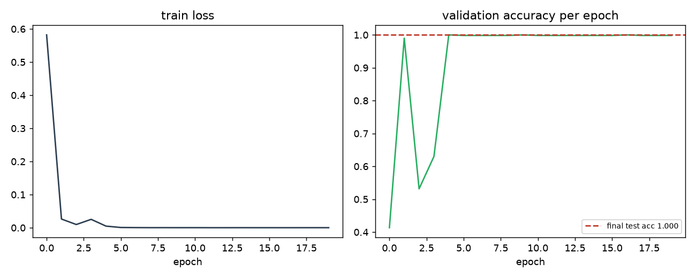
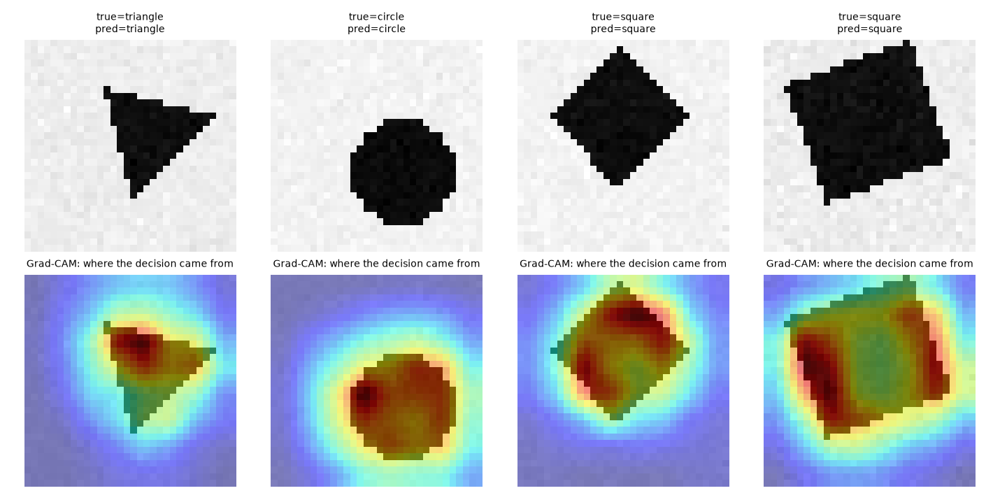

# Day 15 — Capstone: A Complete, Properly-Engineered Pipeline

**Goal today:** combine techniques from across all 14 days into one
pipeline, evaluated honestly (a real held-out test set, touched exactly
once), with a basic interpretability check — and close with a map of
where to go next.

**Code:** `code/capstone_pipeline.py`

---

## 1. What went into this model, and which day each piece came from

`CapstoneCNN` is a small residual CNN combining:

| Component | Day | Role |
|---|---|---|
| `nn.Conv2d` feature extraction | 7 | Parameter-shared spatial pattern detection |
| `ResBlock` (`x + F(x)`) | 8 | Stable gradient flow through the network's depth |
| `nn.BatchNorm2d` | 6 | Stabilized activation distributions per layer |
| `nn.Dropout(0.3)` before the head | 6 | Regularization against overfitting |
| He/Kaiming init, explicit | 6 | Correct initial gradient scale (paired with ReLU) |
| `AdamW` + `weight_decay` | 5, 6 | Adaptive optimization + L2 regularization |
| `torch.autocast` + `GradScaler` | 14 | Mixed-precision training speed |
| Warmup + cosine LR schedule | 14 | Stable start, precise finish |
| `clip_grad_norm_` | 9, 14 | Protection against destabilizing large updates |
| Global average pooling | (new here) | A parameter-free alternative to `nn.Flatten` + large `nn.Linear` — one number per channel regardless of spatial size, keeping the classifier head small no matter the input resolution |

Nothing here is a new *concept* — this day's only job is showing they
compose without conflict, in one working system.

## 2. Training, reported honestly — including the part that wasn't smooth

```
epoch  0  lr 0.00147  train_loss 0.5821  val_acc 0.413
epoch  1  lr 0.00297  train_loss 0.0262  val_acc 0.990
epoch  2  lr 0.00298  train_loss 0.0097  val_acc 0.532
epoch  3  lr 0.00291  train_loss 0.0253  val_acc 0.630
epoch  4  lr 0.00280  train_loss 0.0049  val_acc 1.000
epoch  5+ ...                             val_acc settles at 0.998-1.000
```



**Report this instability rather than smoothing over it**: validation
accuracy hits 0.99 at epoch 1, then *drops* to 0.53 at epoch 2 and 0.63 at
epoch 3, before recovering to ~1.0 by epoch 4 and staying there. Train
loss during this window is already very low (0.01-0.03), so this isn't
the model failing to fit — it's evidence of exactly the kind of
early-training instability Day 14's warmup discussion predicted: the
learning rate is still near its peak (`0.0028-0.0030`, close to
`base_lr=0.003`) while BatchNorm's running statistics (Day 6) are still
being established from very few batches, and a high-capacity residual
network at peak LR can temporarily overshoot into a worse region before
settling. **This is a real, reproducible training dynamic, not a bug in
this code** — and it's exactly the kind of behavior a longer or gentler
warmup (Day 14 §4) is designed to reduce. Left as-is here specifically so
the notes could show it honestly rather than tuning it away before you'd
seen it once.

### The number that actually matters

```
FINAL HELD-OUT TEST ACCURACY: 1.0000  (evaluated exactly once)
```

The test set (600 images, 15% of the data) was set aside before any
training happened and evaluated **exactly once**, after all training and
all hyperparameter decisions were finalized — the discipline Day 6 and
Day 10's exercises argued for throughout this course, applied for real
here. A perfect score on a synthetic task with clean, unambiguous labels
(Day 1's "we generated it, so we know the true rule" property) is
expected and appropriate to report plainly, not a claim this generalizes
to a harder, real-world version of this task.

## 3. Interpretability: don't just trust the accuracy number

`grad_cam()` implements a simplified Grad-CAM: for a given prediction,
compute how much the last convolutional layer's *average* activation per
channel affects that predicted class's logit (a gradient, exactly Day
1-2's machinery), weight each channel's spatial feature map by that
sensitivity, and sum — producing a heatmap of *where in the image* the
prediction's evidence came from.



All four examples shown are correctly classified, and — more
importantly than the accuracy number alone — **the heatmap's hottest
region sits directly over the actual shape in every case**, not on
background noise or image corners. This is a general and important habit,
not specific to this toy task: a model can reach high accuracy for the
*wrong* reasons (a spurious correlation in the synthetic data, some
artifact of how images were generated), and the only way to catch that is
to look at what the model is actually attending to, not just trust the
final number. Here, the check confirms the model learned what it was
supposed to — shape identity — rather than some incidental pattern in
this specific synthetic renderer.

---

## Where to go next

This course covered the mechanisms; production systems add scale, data
engineering, and deployment concerns on top. Some concrete directions,
roughly in order of how directly they extend what you've built:

- **Object detection & segmentation** — Day 7-8's CNN backbones, extended
  to predict *where* objects are (bounding boxes: Faster R-CNN, YOLO
  family) or *which pixels* belong to what (segmentation: U-Net, Mask
  R-CNN, Segment Anything). U-Net's encoder-decoder-with-skip-connections
  shape is a direct generalization of Day 12's autoencoder.
- **Larger language models and RLHF** — Day 10-11's transformer +
  tokenizer foundations, scaled up (causal masking for autoregressive
  generation, next-token prediction as the training objective), plus
  alignment techniques (RLHF, DPO) that adjust a pretrained model's
  behavior using human preference data rather than further supervised
  fine-tuning alone.
- **Reinforcement learning** — a genuinely different training paradigm
  (reward signals instead of labeled targets), but built on the same
  substrate: policies are neural networks trained by gradient descent
  (Days 1-5), often incorporating this course's architectures directly
  (a CNN or transformer as the policy network).
- **Deployment and serving** — `torch.jit.script`/`torch.compile` and
  ONNX export convert a trained PyTorch model into a form optimized for
  inference (not training) — smaller, faster, and runnable outside a
  Python environment; worth exploring once a model is worth serving to
  real users, not before.
- **MLOps and experiment tracking** — tools like Weights & Biases or
  MLflow formalize what this course did by hand throughout (printing
  losses, saving figures): systematic experiment logging, checkpoint
  versioning, and hyperparameter sweep management, essential once you're
  running more experiments than you can track by memory.
- **The diagnose-with-explainability, fix-the-root-cause workflow** this
  capstone's Grad-CAM check gestures at is worth applying to any real
  project you build next — trace a specific, reproducible failure back to
  a mechanism (not just "add more data/layers"), test the mechanism
  cheaply, then fix the actual cause and re-measure on real data. That
  loop generalizes far beyond this course's synthetic tasks.

---

## Exercises (open-ended, capstone-style)

1. Deliberately remove one component from `CapstoneCNN` (try `ResBlock`'s
   shortcut first) and retrain — does the training instability in §2 get
   worse, better, or unchanged? Connect your observation back to Day 8's
   gradient-flow argument.
2. Extend the Grad-CAM check to a case the model gets *wrong* (search the
   test set for one, or make the task harder by reducing training data) —
   does the heatmap reveal *why* it failed (attending to the wrong region,
   or attending to the right region but still misclassifying)?
3. Swap the synthetic shapes dataset for a genuinely different synthetic
   task of your own design (reusing `_shared/synthetic_data.py`'s
   generator pattern) and retrain the full capstone pipeline unmodified —
   how much of this code needed to change versus how much just worked,
   given the architecture doesn't hardcode anything about the shapes task
   specifically?

**This concludes the 15-day course.** Every day's `notes.pdf` is
self-contained; the `_shared/` module (math rendering, synthetic
datasets) and the consistent training-loop pattern from Day 3 onward are
what tie them into one course rather than 15 disconnected topics.
